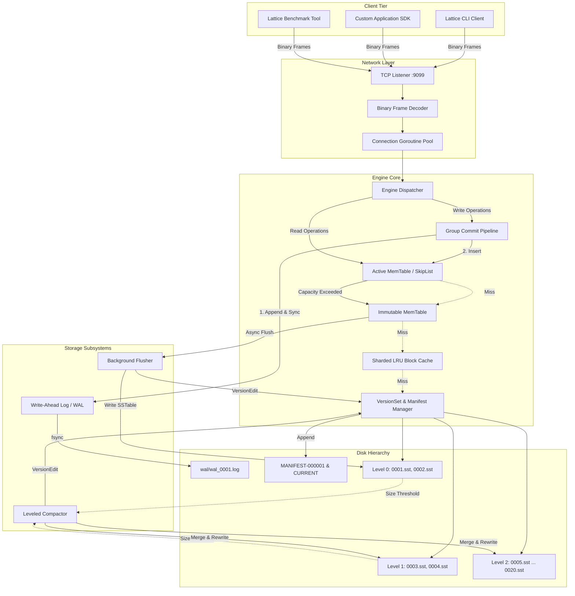
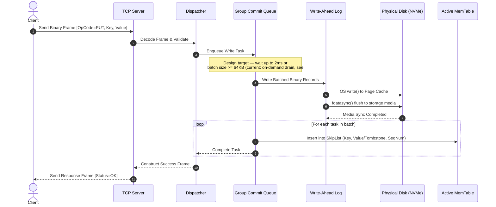
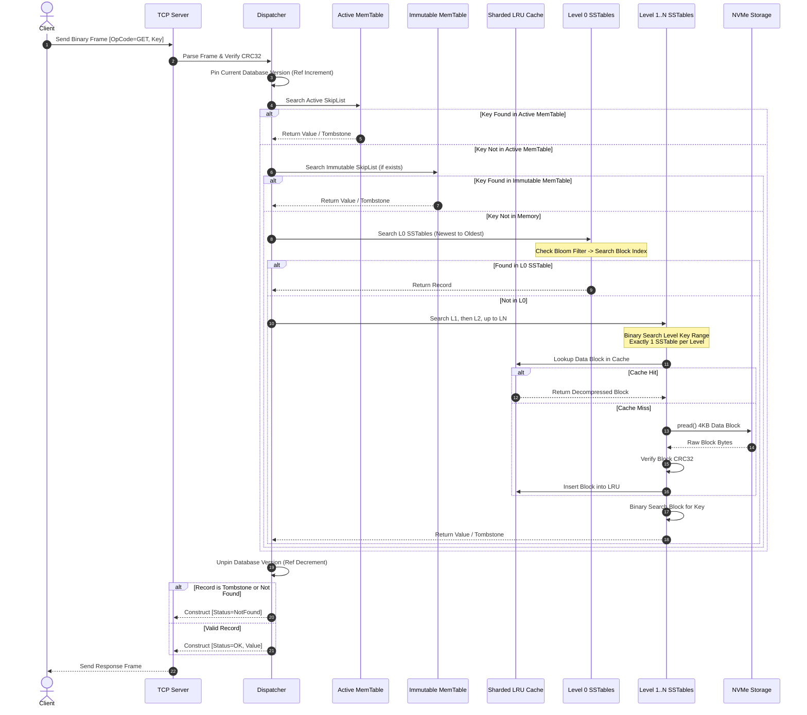
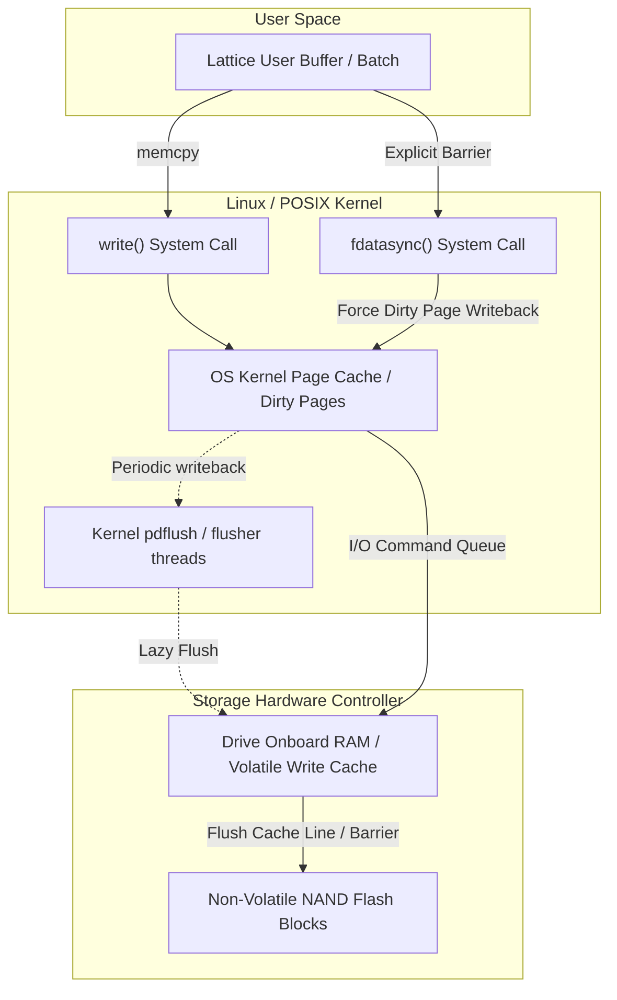
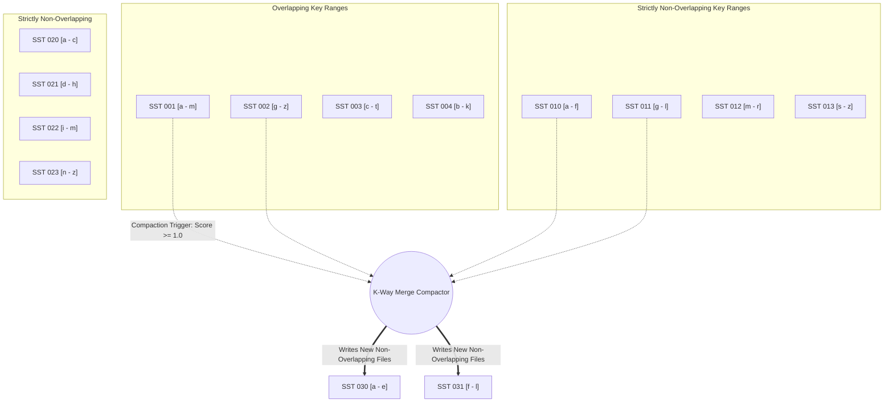
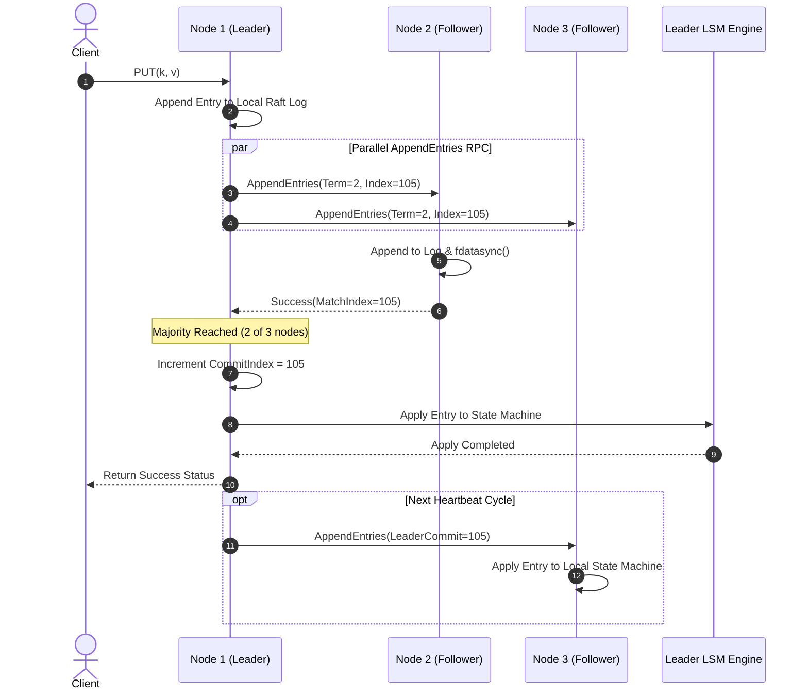
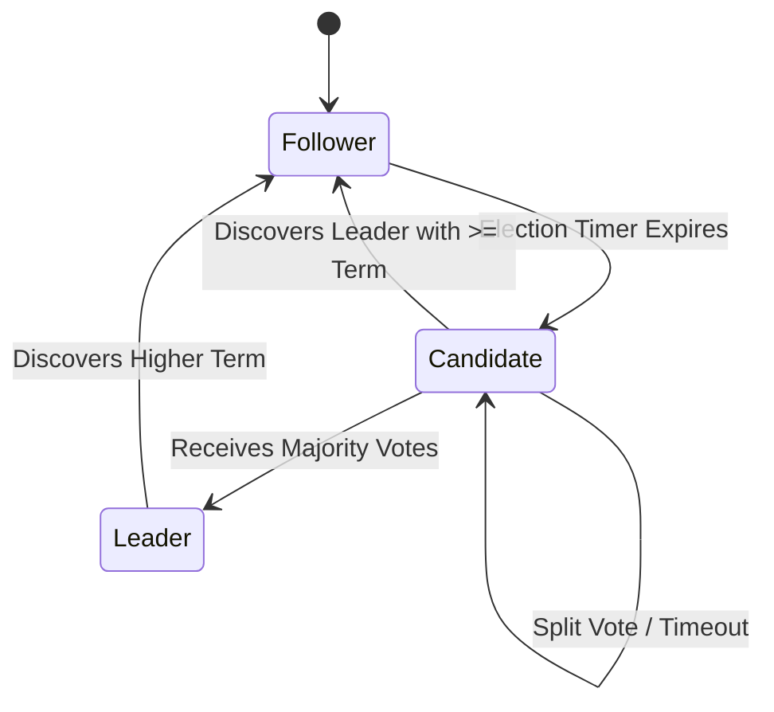
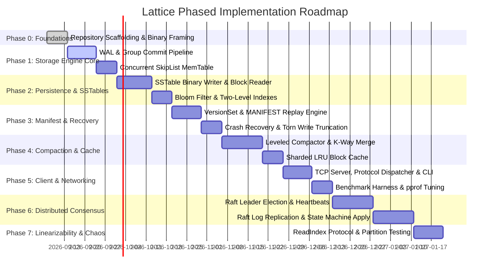

# Lattice: Architecture & System Design Specification
**A High-Performance Distributed Key-Value Storage Engine Built from the Ground Up**

* **Document Version**: 1.0.0-PROD-SPEC
* **Author**: Engineering Architect / Senior Distributed Systems Engineer
* **Target Audience**: SDE1 / SDE2 Interviewers, Systems Engineers, Core Contributors
* **Language & Runtime**: Go 1.22+ (Strict Memory Safety, Goroutines, Low-level File I/O, `sync/atomic`, `-race`)
* **Status**: Approved for Implementation

---

## Table of Contents

1. [Executive Summary](#1-executive-summary)
2. [Problem Statement & Motivation](#2-problem-statement--motivation)
3. [Project Goals](#3-project-goals)
4. [Non-Goals ("What We Are NOT Building")](#4-non-goals-what-we-are-not-building)
5. [User & Client Requirements](#5-user--client-requirements)
6. [Functional Requirements](#6-functional-requirements)
7. [Non-Functional Requirements & Invariants](#7-non-functional-requirements--invariants)
8. [Version 1 Scope (Must-Have Foundation)](#8-version-1-scope-must-have-foundation)
9. [Future Scope (V1.1 Distributed Consensus & Beyond)](#9-future-scope-v11-distributed-consensus--beyond)
10. [Technology Selection & Deep Justification](#10-technology-selection--deep-justification)
11. [High-Level System Architecture](#11-high-level-system-architecture)
12. [Detailed Component Breakdown](#12-detailed-component-breakdown)
13. [Data Flow & Lifecycle](#13-data-flow--lifecycle)
14. [Write Path Deep-Dive](#14-write-path-deep-dive)
15. [Read Path Deep-Dive](#15-read-path-deep-dive)
16. [Delete Path Deep-Dive](#16-delete-path-deep-dive)
17. [Persistence Flow & Operating System I/O](#17-persistence-flow--operating-system-io)
18. [Write-Ahead Log (WAL) Specification](#18-write-ahead-log-wal-specification)
19. [Recovery & Startup Flow](#19-recovery--startup-flow)
20. [Storage Engine Design (LSM-Tree Foundation)](#20-storage-engine-design-lsm-tree-foundation)
21. [MemTable Architecture & SkipList Design](#21-memtable-architecture--skiplist-design)
22. [SSTable File Format Specification](#22-sstable-file-format-specification)
23. [Bloom Filter Subsystem Design](#23-bloom-filter-subsystem-design)
24. [Compaction Subsystem Design (Leveled Compaction)](#24-compaction-subsystem-design-leveled-compaction)
25. [Concurrency, Memory Safety & Synchronization Model](#25-concurrency-memory-safety--synchronization-model)
26. [Networking Model & Wire Protocol Specification](#26-networking-model--wire-protocol-specification)
27. [Distributed Cluster Architecture (V1.1 Blueprint)](#27-distributed-cluster-architecture-v11-blueprint)
28. [Replication Model](#28-replication-model)
29. [Consensus Evaluation & Raft Protocol Integration](#29-consensus-evaluation--raft-protocol-integration)
30. [Leader Election & Heartbeat Design](#30-leader-election--heartbeat-design)
31. [Failure Scenarios & Fault Tolerance Matrix](#31-failure-scenarios--fault-tolerance-matrix)
32. [Consistency Model & Formal Guarantees](#32-consistency-model--formal-guarantees)
33. [Sharding & Partitioning Evaluation](#33-sharding--partitioning-evaluation)
34. [In-Memory Caching (Sharded LRU Block Cache)](#34-in-memory-caching-sharded-lru-block-cache)
35. [Observability, Telemetry & Diagnostics](#35-observability-telemetry--diagnostics)
36. [Benchmarking Strategy & Performance Profiling](#36-benchmarking-strategy--performance-profiling)
37. [Comprehensive Testing Strategy & Chaos Injection](#37-comprehensive-testing-strategy--chaos-injection)
38. [Data Model & Internal Serialization Formats](#38-data-model--internal-serialization-formats)
39. [Security, Boundaries & Transport Hygiene](#39-security-boundaries--transport-hygiene)
40. [Configuration Management](#40-configuration-management)
41. [CLI & Developer Experience](#41-cli--developer-experience)
42. [Repository & Module Structure](#42-repository--module-structure)
43. [Architecture Trade-Offs Matrix](#43-architecture-trade-offs-matrix)
44. [Versioning, Schema Evolution & Backward Compatibility](#44-versioning-schema-evolution--backward-compatibility)
45. [Implementation Roadmap (Phases 0 Through 8)](#45-implementation-roadmap-phases-0-through-8)
46. [Risks, Bottlenecks & Production Mitigations](#46-risks-bottlenecks--production-mitigations)
47. [Interview-Oriented Master Guide: Concepts & 50 Questions](#47-interview-oriented-master-guide-concepts--50-questions)
48. [Resume-Oriented Strategic Evaluation](#48-resume-oriented-strategic-evaluation)

---

# 1. Executive Summary

**Lattice** is an industrial-grade, distributed key-value storage engine engineered from the ground up in Go. It does not wrap SQLite, LevelDB, RocksDB, Redis, or etcd. Every subsystem—from append-only write-ahead logging (WAL) and memory-mapped block serialization to probabilistic Bloom filtering, k-way leveled merge compaction, and TCP binary framing—is built from fundamental systems primitives.

Lattice is structured in two distinct, disciplined engineering phases:
1. **Version 1.0 (Core Storage Engine & Protocol)**: A production-ready single-node Log-Structured Merge-Tree (LSM-tree) storage engine featuring high-throughput Group Commit durability, a concurrent SkipList MemTable, immutable SSTables with two-level block indexing, sharded LRU block caching, Leveled Compaction ($L0..L_N$), crash recovery using an append-only `MANIFEST` log, and a low-overhead custom binary wire protocol over raw TCP.
2. **Version 1.1 (Distributed Consensus Layer)**: A fault-tolerant, replicated distributed cluster implementing single-group Raft consensus. This phase adds distributed state machine replication, leader election, randomized heartbeat scheduling, quorum commit safety ($Q = \lfloor N/2 \rfloor + 1$), and linearizable reads using the `ReadIndex` protocol.

```
+-----------------------------------------------------------------------------------+
|                                  LATTICE SYSTEM                                   |
|                                                                                   |
|  +--------------------+        +--------------------+        +-----------------+  |
|  |    TCP Clients     |  --->  |    Wire Protocol   |  --->  | Engine Dispatch |  |
|  |  (CLI / Bench / SDK|        |  (Binary Framing)  |        | (Group Commit)  |  |
|  +--------------------+        +--------------------+        +--------+--------+  |
|                                                                       |           |
|         +-------------------------------------------------------------+           |
|         |                                                                         |
|         v                                                             v           |
|  +--------------+   Buffered Appends   +--------------+         +--------------+  |
|  |  Write-Ahead | ===================> | Page Cache / |         | Active       |  |
|  |  Log (WAL)   |   `fdatasync()`      | Disk Drive   |         | MemTable     |  |
|  +--------------+                      +--------------+         | (SkipList)   |  |
|                                                                 +-------+------+  |
|                                                                         | Swap    |
|                                                                         v         |
|  +--------------------+   Flushes via Merge   +--------------------------------+  |
|  |   Leveled SSTables | <==================== | Immutable MemTable Pipeline    |  |
|  | (L0..LN, Bloom, Idx|                       +--------------------------------+  |
|  +---------+----------+                                                           |
|            |                                                                      |
|            +============== k-way Merging Compactor (Background)                   |
+-----------------------------------------------------------------------------------+
```

---

# 2. Problem Statement & Motivation

Many junior software engineering portfolios rely on superficial wrappers: deploying Redis via Docker, running CRUD REST endpoints over PostgreSQL, or stitching together framework boilerplate. While these showcase high-level API consumption, they demonstrate little to no understanding of:
* How bits are physically laid out, addressed, and synced to persistent block devices.
* How operating system page caches, dirty-page flushing, and kernel write barriers affect throughput and tail latency.
* How to balance CPU cache-line locality against algorithmic complexity in concurrent data structures.
* How distributed consensus protocols resolve network partitions, split-brain conditions, and non-deterministic clock drift without losing or corrupting data.

**Lattice solves this credibility gap.** By designing and implementing a database from bare system calls (`open`, `read`, `write`, `fdatasync`, `epoll`/network polling) up to consensus invariants, Lattice provides an unassailable demonstration of foundational computer science, systems programming, and production-grade software engineering.

---

# 3. Project Goals

### 3.1 Educational & Algorithmic Goals
1. **Low-Level Storage Internals**: Master append-only write paths, variable-length binary encoding, SSTable block alignments, sparse index binary search, and Murmur3/FNV-1a Bloom filter math.
2. **Advanced Concurrency**: Implement fine-grained synchronization, atomic pointer swaps (`unsafe.Pointer`), reader-writer invariants, and cooperative write-coalescing pipelines (Group Commit).
3. **Distributed Systems Invariants**: Master state machine replication, consensus safety invariants, term epochs, leader leases, quorum intersection math, and network failure modes.

### 3.2 Engineering & Production Goals
1. **Deterministic Durability**: Zero data loss for acknowledged (synced) writes upon abrupt process termination (`SIGKILL`). Durability scope: Linux with a journaling filesystem after a successful `fdatasync()` barrier; subject to storage controller-cache behavior on true power loss and to the rotation dir-entry window documented in `docs/known-limitations.md` (#11, #13, #15). Darwin/Windows builds fall back to `f.Sync()`.
2. **Predictable Tail Latency**: Prevent write stalls during background compaction through dynamic backpressure and rate-limiting heuristics.
3. **Rigorous Testability**: Support deterministic crash injection, property-based storage invariants, fuzz testing of raw binary frames, and network partition chaos testing.
4. **Transparent Benchmarkability**: Provide a high-throughput load generator outputting P50, P90, P99, and P99.9 latencies, allocations/op, and system call efficiency.

---

# 4. Non-Goals ("What We Are NOT Building")

To prevent scope explosion and ensure every included feature is delivered with production-level depth, the following items are **explicitly excluded**:

* **No Relational Engine / SQL Parser**: No AST compilation, algebraic query planning, or table joins. Lattice is a pure Key-Value engine.
* **No Multi-Key Distributed ACID Transactions**: No Two-Phase Commit (2PC), distributed lock managers, or serializable snapshot isolation across partitioned ranges.
* **No Dynamic Cloud Provisioning / Kubernetes Operators**: Lattice binaries execute as self-contained system daemons configured via flags or files.
* **No Native Web Admin GUI**: Diagnostic inspection is conducted via dedicated CLI commands (`lattice inspect-sstable`, `lattice dump-wal`, `lattice stats`) and Prometheus metrics endpoints.
* **No Pluggable Third-Party Storage Backends**: Lattice does not support swappable engines (e.g. plugging RocksDB under our Raft layer); the storage engine itself is the primary artifact.

---

# 5. User & Client Requirements

### 5.1 Client Interaction Primitives
The engine exposes five canonical operations over TCP:
* `PUT(Key, Value) -> Status`: Atomically insert or overwrite a key-value record.
* `GET(Key) -> (Value, Found, Status)`: Retrieve the latest value associated with a key.
* `DELETE(Key) -> Status`: Atomically record a tombstone, rendering the key nonexistent.
* `EXISTS(Key) -> (Bool, Status)`: Low-overhead metadata existence check.
* `BATCH(WriteBatch) -> Status`: Atomic application of a heterogeneous sequence of `PUT` and `DELETE` operations.
  - **Batch Ordering Semantics**: Operations in a batch are applied in strict sequential request order. If a batch contains duplicate keys, subsequent operations deterministically overwrite or delete previous ones (e.g. `PUT A=1`, `DELETE A`, `PUT A=2` results in `A=2`).
  - **Atomic Visibility**: Concurrent reads never observe an intermediate state of an executing batch. The entire batch is either completely visible or not visible at all.
  - **Durability Guarantee**: Live writes emit `BATCH_START` followed by ordered `PUT`/`DELETE` records, concluded with `BATCH_COMMIT` under contiguous sequence numbers, and explicitly execute `Sync()` to disk before client acknowledgment.
  - **Recovery Contract**: Open batches torn at log tail without a matching `BATCH_COMMIT` are discarded during recovery; fully committed batches are recovered in totality.
  - **Architectural Distinction**:
    - *User-Level BATCH Atomicity*: Transactional all-or-nothing semantic contract for a user's multi-key mutation.
    - *Group Commit Batching*: Storage engine physical I/O optimization amortizing `fdatasync()` across concurrent independent writes without merging logical transactions.
    - *Raft Batch Replication*: Clustered consensus replication where an entire user batch is packaged into a single Raft log entry (`OpTypeBatch`) and applied atomically across the replicated state machine.

### 5.2 Service-Level Performance Targets (Single-Node Baseline on Modern NVMe SSD)
* **Write Throughput**: $\ge 80,000 \text{ ops/sec}$ with Group Commit enabled.
* **Write P99 Latency**: $\le 2.5 \text{ ms}$ under sustained load.
* **Read Throughput (Hot Cache)**: $\ge 150,000 \text{ ops/sec}$.
* **Read Throughput (Random NVMe Disk Hits)**: $\ge 35,000 \text{ ops/sec}$.
* **Crash Recovery Time**: $\le 1.5 \text{ seconds}$ for a 1GB WAL log replay.

---

# 6. Functional Requirements

1. **Arbitrary Binary Keys and Values**: Keys and values are treated as opaque byte slices (`[]byte`). No UTF-8 assumptions are enforced.
2. **Key Constraints**: $1 \text{ byte} \le \text{Key Length} \le 65,535 \text{ bytes (64 KB)}$. Empty keys are rejected with `ErrEmptyKey`.
3. **Value Constraints**: $0 \text{ bytes} \le \text{Value Length} \le 4,194,304 \text{ bytes (4 MB)}$. Zero-length values are legal (valueless markers).
4. **Idempotent Batch Writes**: Batches are all-or-nothing. A crash during a batch application never applies partial updates.
5. **Crash Recovery Guarantee**: When the server restarts after an ungraceful crash, the database recovers to the exact sequence of all acknowledged (successfully synced) writes, subject to the durability scope in §3.2 and `docs/known-limitations.md` (#11, #15). Full startup replay wiring is Phase 07 scope.
6. **Graceful Shutdown**: `SIGINT` / `SIGTERM` signals cause the engine to halt accepting new ingress network connections, flush the active MemTable, sync the `MANIFEST`, and cleanly close all file descriptors.

---

# 7. Non-Functional Requirements & Invariants

### 7.1 Durability Invariants
* **Strict Durability Mode**: Every `PUT` / `BATCH` invokes `fdatasync()` on the WAL file descriptor before returning an acknowledgement to the client.
* **Group Commit Mode (Default)**: Concurrently queued writes are batched into a single OS write and synchronous `fdatasync()`. Design-target latency bound: micro-timer ($\le 2 \text{ ms}$) or batch size threshold (e.g. 64 KB). Current implementation (`P02-S04`) coalesces on demand — draining up to 1024 tasks / 64 KiB with no linger timer — so serial workloads form singleton batches at raw sync latency; see `docs/known-limitations.md` (#13).

### 7.2 Read Invariants (Point-in-Time Consistency)
* Reads observe monotonic progress: once a write $W_1$ is acknowledged, no subsequent read can observe a state prior to $W_1$.
* Point-in-time snapshot isolation: a long-running read or scan references an immutable `Version` pointer and never experiences partial or corrupted block reads caused by concurrent compactions.

### 7.3 Memory Boundedness
* In-memory memory utilization is strictly bounded by configuration:
  $$\text{RAM}_{\text{total}} \approx \text{MemTable}_{\text{active}} + \text{MemTable}_{\text{imm}} + \text{Cache}_{\text{LRU}} + \text{IndexFilter}_{\text{resident}}$$
* Memory exhaustion triggers write-stall backpressure, never an Out-Of-Memory (`OOM`) process panic.

---

# 8. Version 1 Scope (Must-Have Foundation)

V1 is intentionally limited to a single-node engine to guarantee architectural perfection and eliminate half-baked abstractions:

* **WAL Engine**: Append-only binary log with CRC32-IEEE checksumming, segment rotation, and group commit queue.
* **MemTable**: Probabilistic SkipList supporting concurrent lock-free reads and synchronized appends.
* **Flushing Subsystem**: Non-blocking atomic transition of Active MemTable to Immutable MemTable with asynchronous background flushing to Level 0 SSTables.
* **SSTable Storage**: Custom binary layout with 4KB Data Blocks, prefix compression, Filter Blocks (Bloom filters), Two-Level Block Indexes, and 48-byte fixed Footers.
* **Leveled Compaction**: Level 0 overlapping merge to Level 1, followed by size-tiered/leveled partitioning across $L_1..L_N$ with a $10\times$ size multiplier.
* **Metadata & Manifest Subsystem**: Append-only `MANIFEST` log persisting `VersionEdit` records with a pointer-swapped atomic `CURRENT` file.
* **Read Cache**: Thread-safe sharded LRU Block Cache for 4KB SSTable data blocks.
* **TCP Wire Protocol**: Custom length-prefixed binary framing protocol with framing validation and error handling.
* **Diagnostics & CLI**: Full command-line client supporting REPL operations, SSTable hex/block dumping, and load testing.

---

# 9. Future Scope (V1.1 Distributed Consensus & Beyond)

### 9.1 Version 1.1 Scope (Distributed Consensus)
* **Single-Raft Consensus Group**: Complete Raft implementation (Candidate, Follower, Leader state machine).
* **Distributed WAL**: Raft log entries replicated to a majority of quorum nodes ($N=3$ or $N=5$) before being applied to the local LSM state machine.
* **Leader Election**: Randomized election timers ($150\text{ms} - 300\text{ms}$), `RequestVote` RPC handling, term stepping, and split-vote mitigation.
* **Linearizable Reads**: `ReadIndex` protocol verifying current leadership through heartbeat quorums before serving reads.
* **Node Recovery**: Catch-up synchronization via Raft log replication and SSTable baseline snapshot transfers.

### 9.2 Post-V1.1 Scope (Horizontal Sharding & Scale-Out)
* **Multi-Raft Architecture**: Splitting key ranges into dynamic partitions (tablets), each managed by an independent Raft consensus group.
* **Consistent Hashing / Range Partitioning**: Hash-ring or range-based routing tier directing clients to the appropriate partition leader.
* **Automatic Split & Merge**: Dynamic splitting of partitions exceeding size thresholds (e.g. 64GB).

---

# 10. Technology Selection & Deep Justification

### 10.1 Language Evaluation Matrix

| Criteria | Go (Selected) | Rust | C++ | Java |
| :--- | :--- | :--- | :--- | :--- |
| **Concurrency Primitives** | Built-in goroutines, channels, lightweight stacks ($2\text{KB}$), `sync/atomic` | `tokio`, threads, async/await | `std::thread`, POSIX pthreads, manual locks | OS threads, virtual threads, `java.util.concurrent` |
| **Memory Safety** | Garbage Collected, pointer-safe, strictly typed, zero-dangling pointers | Strict compile-time borrow checker, zero-cost abstractions | Manual memory management, risk of segfaults / memory leaks | Garbage Collected, high memory footprint |
| **Low-Level File I/O** | Direct POSIX wrappers (`syscall`, `os.File`, `unix.Fdatasync`) | Direct `libc` / `std::fs` | Direct POSIX syscalls | Indirect via `java.nio.FileChannel` |
| **Development Velocity** | Extremely high; rapid iteration for single developer | Medium; high cognitive overhead around async/lifetime modeling | Low; build tools (CMake) and memory debugging are time sinks | Medium; verbose boilerplate |
| **Tooling & Profiling** | World-class built-in tooling: `go test -race`, `pprof`, `go bench` | `cargo`, `valgrind`, `perf` | `gdb`, `valgrind`, `perf`, Sanitizers | VisualVM, JProfiler, GC tuning |
| **Distributed Systems Ecosystem** | Dominant industry standard (etcd, Kubernetes, Consul, CockroachDB) | Growing fast (TiKV) | Legacy enterprise (RocksDB, ClickHouse) | Legacy enterprise (Hadoop, Cassandra, Kafka) |

### 10.2 Architectural Verdict: Why Go?
Go was selected because it represents the gold standard for modern distributed systems engineering. It allows an engineer to manipulate low-level operating system constructs (raw byte buffers, binary encoding, file descriptors, `fdatasync`, direct syscalls) while providing concurrent runtime ergonomics (goroutines and channels) that make writing bulletproof network servers and consensus state machines achievable without getting trapped in memory safety edge cases. Furthermore, Go's integrated race detector (`-race`) and CPU/memory profiling tools (`pprof`) allow immediate verification of performance claims.

---

# 11. High-Level System Architecture



---

# 12. Detailed Component Breakdown

### 12.1 Network Listener & Frame Decoder (`internal/transport`)
Accepts raw TCP connections, assigns each connection a dedicated read goroutine, and parses length-prefixed binary frames. Manages connection timeouts, keep-alive probes, and prevents buffer-bloat denial of service attacks by enforcing maximum frame size ceilings.

### 12.2 Engine Dispatcher & Concurrency Coordinator (`internal/engine`)
The operational gateway. Manages reader-writer coordination, coordinates write requests into the Group Commit pipeline, and ensures read operations obtain a reference-counted snapshot of the database state.

### 12.3 Group Commit Subsystem (`internal/wal`)
A lock-free ring-buffer / channel queue that aggregates concurrent writes from hundreds of client goroutines into a single sequential write buffer, issuing one synchronous `fdatasync()` for the entire batch before broadcasting completion to all waiting callers.

### 12.4 MemTable (`internal/memtable`)
An in-memory, sorted concurrent SkipList. Provides $O(\log N)$ inserts, lookups, and range scans. Tracks exact memory allocations down to the byte to trigger flushes when the threshold (default $64\text{MB}$) is reached.

### 12.5 Flusher Pipeline (`internal/engine`)
An asynchronous background coordinator that takes an Immutable MemTable, writes it sequentially to disk as an $L_0$ SSTable file, constructs its Bloom filter and block indexes, registers the new file with the `VersionSet`, and releases the in-memory structure for garbage collection.

### 12.6 SSTable Manager & Reader (`internal/sstable`)
Encapsulates physical SSTable file descriptors. Reads data blocks on demand, verifies block CRC32 checksums, interrogates in-memory Bloom filters, and performs binary searches across block index boundaries.

### 12.7 Leveled Compactor (`internal/compaction`)
A dedicated background worker that evaluates compaction scores across levels $L_0$ through $L_N$. Orchestrates multi-way merge iterators (k-way merge), purges obsolete keys and expired tombstones, generates new SSTables, and updates the `VersionSet`.

### 12.8 `VersionSet` & Manifest Coordinator (`internal/version`)
The source of truth for physical file layouts. Maintains the active `Version`, tracks which SSTables belong to which level, records smallest and largest key boundaries, and commits all state transitions atomically via append-only `MANIFEST` records.

### 12.9 Sharded LRU Block Cache (`internal/cache`)
A user-space read cache holding uncompressed 4KB SSTable data blocks in memory. Partitioned into 16 independent LRU shards to eliminate global mutex contention across concurrent CPU cores.

---

# 13. Data Flow & Lifecycle

```
[Client Write: PUT(k, v)]
          |
          v
   +--------------+
   | Group Commit | ===> [Write to WAL on Disk] ===> [Sync WAL: `fdatasync()`]
   +--------------+
          |
          v
   [Insert into Active MemTable (RAM)]
          |
          | (When MemTable reaches 64MB)
          v
   [Atomic Swap: Active -> Immutable MemTable]
          |
          v
   [Background Flusher Worker]
          |
          v
   [Create Level 0 SSTable File]
   - Write 4KB Data Blocks
   - Build Bloom Filter
   - Build Two-Level Index
   - Append 48-Byte Footer
   - Call `fdatasync()` on SSTable
          |
          v
   [Commit VersionEdit to MANIFEST Log]
          |
          v
   [Discard Old WAL Segment & Free Immutable MemTable]
          |
          v
   [Background Leveled Compaction (L0 -> L1 -> L2)]
   - K-Way Merge Sort
   - Drop Overwritten Revisions
   - Purge Tombstones (if safe)
   - Output New Partitioned SSTables
```

---

# 14. Write Path Deep-Dive

Every write operation (`PUT`, `DELETE`, or `BATCH`) executes through the following rigorous sequential pipeline:



### 14.1 Step-by-Step Execution
1. **Frame Ingestion**: The TCP worker reads the header, verifies magic bytes (`0x4C415454`), checks CRC32 integrity, and unpacks the key-value payload.
2. **Backpressure Check**: If background compaction has fallen catastrophically behind (e.g., $L0$ file count exceeds safety limits), the dispatcher introduces a dynamic write delay ($1\text{ms} - 50\text{ms}$) to prevent disk saturation.
3. **Queue Enqueue**: The goroutine constructs a `writeTask` and enqueues it onto the lock-free Group Commit queue.
4. **Cooperative Batching**: A designated leader goroutine drains up to $N=1024$ pending writes or $64\text{KB}$ of data from the queue into a contiguous memory buffer.
5. **Sequential Log Append**: The leader calls `file.Write(coalescedBuffer)` on the active WAL file descriptor.
6. **Hardware Barrier (`fdatasync`)**: The leader issues an OS system call `fdatasync()` ensuring all bytes leave the OS page cache and reach the storage device (durable subject to device controller-cache behavior on true power loss; see §3.2 scope). On non-Linux platforms the barrier falls back to `f.Sync()`.
7. **MemTable Insertion**: Upon sync return, the writes are inserted in ascending sequence number order into the concurrent SkipList.
8. **Client Acknowledgement**: The leader signals completion to all follower goroutines via their individual response channels; each writes back a success frame to its respective TCP connection.

---

# 15. Read Path Deep-Dive



### 15.2 Read Invariant Guarantees
* **Temporal Ordering**: Because keys are checked from youngest to oldest ($\text{Active MemTable} \to \text{Immutable MemTable} \to L0 \to L1 \to \dots \to L_N$), the reader is mathematically guaranteed to observe the most recent revision of any key without checking older files.
* **Tombstone Semantics**: If a tombstone record is encountered anywhere along this search hierarchy, the read immediately terminates and returns `Status=NotFound`.

---

# 16. Delete Path Deep-Dive

In an append-only LSM storage engine, data is never deleted in-place on disk. In-place deletion would convert sequential I/O into random I/O and break immutable file invariants.

### 16.1 Tombstone Lifecycle
1. **Tombstone Creation**: A `DELETE(Key)` request enters the write path identical to a `PUT`.
2. **Log & Memory Recording**: A record with `RecordType = 0x02 (TOMBSTONE)`, `ValueLength = 0`, and an incremented `SequenceNumber` is written to the WAL and inserted into the active SkipList MemTable.
3. **Read Masking**: Subsequent `GET` queries finding this tombstone immediately report the key as nonexistent.
4. **SSTable Ingestion**: When the MemTable flushes, the tombstone is written to an $L0$ SSTable just like any normal value.
5. **Compaction Propagation**: As compaction merges $L0 \to L1 \to L_N$, the tombstone overwrites and erases older versions of the key in deeper levels.
6. **Final Garbage Collection (Purge)**: A tombstone can only be physically discarded if:
   * It resides at the absolute lowest level ($L_{max}$) containing data, **OR**
   * No higher level contains an older revision of that key.
   * *Safety Invariant*: Dropping a tombstone prematurely while older revisions exist at deeper levels will cause the deleted key to reappear ("ghost key resurrect").

---

# 17. Persistence Flow & Operating System I/O

Understanding the interaction between user-space code and the operating system kernel is critical for durability and latency predictability.



### 17.1 `fsync()` vs `fdatasync()`
* `fsync(fd)` flushes both modified file data and all associated inode metadata (file modification time, file size, access permissions). This frequently requires two separate physical head seeks or flash writes.
* `fdatasync(fd)` flushes exclusively the modified data bytes and only updates inode metadata if the file length itself has changed.
* **Lattice Decision**: Lattice utilizes `fdatasync()` for WAL appends. WAL segments currently grow via `O_APPEND` with rotation at a 64 MB threshold (`P02-S02`); fixed-chunk `fallocate()` pre-allocation (which would hold file length constant during logging and skip inode metadata syncs) remains a conditional future optimization, not current behavior. See `docs/known-limitations.md` (#15).

---

# 18. Write-Ahead Log (WAL) Specification

### 18.1 Physical Binary Record Layout
Each entry written to the WAL adheres to a strict binary wire format designed for zero-allocation parsing and instant corruption detection.

```
+-------------------+--------------------+--------------------+--------------------+
|  CRC32-IEEE (4B)  |   RecordType (1B)  |   SeqNum (8B)      |   Timestamp (8B)   |
+-------------------+--------------------+--------------------+--------------------+
|  KeyLength (2B)   |   KeyBytes (Var)   |   ValueLength (4B) |   ValueBytes (Var) |
+-------------------+--------------------+--------------------+--------------------+
```

* `CRC32-IEEE` (4 bytes, Big-Endian): Checksum calculated across all remaining bytes in the record. Detects bit flips and torn disk writes.
* `RecordType` (1 byte):
  * `0x01`: Standard `PUT` operation.
  * `0x02`: Tombstone `DELETE` operation.
  * `0x03`: `BATCH_START` marker.
  * `0x04`: `BATCH_COMMIT` marker.
* `SeqNum` (8 bytes, Big-Endian): Monotonically increasing 64-bit integer providing global database operation ordering.
* `Timestamp` (8 bytes, Big-Endian): Unix nanosecond timestamp when the record was sequenced.
* `KeyLength` (2 bytes, Big-Endian): uint16 representing key size ($0 \le \text{len} \le 65,535$).
* `KeyBytes`: Raw key payload.
* `ValueLength` (4 bytes, Big-Endian): uint32 representing value size ($0 \le \text{len} \le 4,194,304$).
* `ValueBytes`: Raw value payload.

### 18.2 WAL Segmentation & File Naming
* Files are organized under `<db_path>/wal/`.
* Naming convention: `wal_<000000000001>.log` using zero-padded 12-digit sequential IDs.
* When a MemTable flushes to an SSTable, its associated WAL segment is sealed, unlinked, and deleted once the `MANIFEST` file records the new SSTable.

---

# 19. Recovery & Startup Flow

```mermaid
flowchart TD
    Start([Lattice Server Boot]) --> ReadCurrent{CURRENT File Exists?}
    ReadCurrent -- No --> InitNewDB[Initialize Fresh DB Environment<br/>Create MANIFEST-000001<br/>Write CURRENT Pointer]
    InitNewDB --> Ready([Server Ready for Traffic])

    ReadCurrent -- Yes --> ParseCurrent[Read Active Manifest Path from CURRENT]
    ParseCurrent --> ReplayManifest[Replay MANIFEST VersionEdit Log]
    ReplayManifest --> BuildVersion[Reconstruct Active Version<br/>Register Valid SSTables L0..LN]
    BuildVersion --> VerifyFiles{All SSTable Files Present?}

    VerifyFiles -- Missing File --> PanicMissing[Crash with ErrMissingSSTable<br/>Prevent Unsafe Execution]
    VerifyFiles -- All Present --> ScanWAL[Scan /wal Directory for Uncommitted Logs]

    ScanWAL --> ReplayWALRecords[Iterate WAL Records Sequentially]
    ReplayWALRecords --> VerifyCRC{CRC32 Valid?}
    VerifyCRC -- Valid --> InsertMemTable[Insert Record into Active MemTable]
    InsertMemTable --> NextRecord{More Records?}
    NextRecord -- Yes --> ReplayWALRecords

    VerifyCRC -- Invalid / Torn --> CheckEOF{Is at End of WAL File?}
    CheckEOF -- Yes (Torn Tail Write) --> TruncateTail[Log Warning: Discard Partial Unsynced Write<br/>Truncate to Last Valid Offset]
    CheckEOF -- No (Middle Corruption) --> PanicCorrupt[Crash with ErrWALCorrupted<br/>Require Manual Inspection]

    NextRecord -- No --> FinalizeRecovery[Set Next Sequence Number = Max(SeqNum) + 1]
    TruncateTail --> FinalizeRecovery
    FinalizeRecovery --> Ready
```

### 19.1 Torn Write & Incomplete Flush Recovery
If an ungraceful crash or power loss interrupts a write while bytes are being pushed to disk, the WAL parser will detect a CRC32 mismatch at the tail of the log.
* **Tail Truncation Policy**: If and only if the corrupted record occurs at the final boundary of the latest WAL segment, Lattice treats this as an unacknowledged partial write, truncates the corrupted tail, logs an administrative warning, and resumes safely.
* **Mid-Log Corruption**: If a CRC32 error occurs in the middle of a log file, it indicates media degradation or tampering. The engine halts immediately (`panic`) to prevent silent data corruption.

---

# 20. Storage Engine Design (LSM-Tree Foundation)

### 20.1 Why Log-Structured Merge-Tree?
Traditional database engines (like SQLite, PostgreSQL, and InnoDB) utilize in-place update $B^+$ Trees. In an in-place engine, inserting a key requires finding its leaf page, modifying bytes in place, and writing the entire 8KB/16KB page back to disk. On modern storage media (NAND flash / NVMe), this generates extreme random I/O and severe write amplification (writing 16KB of disk data for a 50-byte record).

The Log-Structured Merge-Tree converts all random writes into sequential writes:
1. Writes append sequentially to the WAL.
2. Writes insert into an in-memory sorted buffer (MemTable).
3. Background threads flush and merge sorted runs sequentially to disk (SSTables).

### 20.2 The Trade-Off Space: The RUM Conjecture
The RUM Conjecture (Read, Update, Memory) states that optimizing for two dimensions inherently penalizes the third:
* **LSM-Tree Choice**: Maximizes Update ($U$) efficiency through sequential writes and optimizes Memory ($M$) footprint via Bloom filters and sparse indexes.
* **Trade-Off**: Higher Read Amplification ($R$) and Write Amplification ($W$) during background compaction. Lattice mitigates read amplification using Bloom filters and a sharded LRU block cache.

---

# 21. MemTable Architecture & SkipList Design

### 21.1 Algorithmic Selection: SkipList vs Red-Black Tree
While Red-Black and AVL trees provide guaranteed $O(\log N)$ worst-case search times, their strict balancing invariants require complex pointer rotations. These rotations touch multiple nodes simultaneously, making lock-free or low-overhead concurrent implementations notoriously difficult.

Lattice adopts a **Probabilistic SkipList**:
* **Complexity**: Expected $O(\log N)$ search, insertion, and deletion.
* **Lock-Free Reads**: Reads traverse forward pointers without acquiring locks (`atomic.LoadPointer`), as nodes are never rotated or rebalanced.
* **Simplicity**: Height generation is governed by a geometric coin-flip distribution ($p = 0.25$, maximum levels $L_{max} = 16$).

```
Level 3:  [Head] -----------------------------------------------------> [Node 25] -------------> [Nil]
Level 2:  [Head] -----------------------------> [Node 12] -------------> [Node 25] -------------> [Nil]
Level 1:  [Head] -------------> [Node 07] ----> [Node 12] -------------> [Node 25] ---> [Node 31] -> [Nil]
Level 0:  [Head] -> [Node 03] -> [Node 07] ----> [Node 12] -> [Node 19] -> [Node 25] ---> [Node 31] -> [Nil]
```

### 21.2 Node Memory Representation
```go
type skipListNode struct {
    key       []byte
    value     []byte
    seqNum    uint64
    opType    byte
    forward   []*skipListNode // Array of forward pointers sized to node height
}
```

---

# 22. SSTable File Format Specification

Every SSTable is a strictly immutable, self-contained binary file containing sorted key-value pairs organized into fixed-size blocks.

### 22.1 SSTable Disk Layout
```
+-----------------------------------------------------------+
| Data Block 0 (4 KB Default, Prefix Compressed Records)    |
+-----------------------------------------------------------+
| Data Block 1 (4 KB)                                       |
+-----------------------------------------------------------+
| ...                                                       |
+-----------------------------------------------------------+
| Data Block N-1                                            |
+-----------------------------------------------------------+
| Filter Block (Serialized Murmur3-based Bloom Filter)      |
+-----------------------------------------------------------+
| Meta Index Block (Pointers to Filter & Properties)        |
+-----------------------------------------------------------+
| Index Block (Block Handles: [Largest Key -> Offset/Size]) |
+-----------------------------------------------------------+
| Footer (Fixed 48 Bytes: Magic Number + Index/Meta Handles)|
+-----------------------------------------------------------+
```

### 22.2 Data Block Internal Structure
To maximize storage density and minimize memory bandwidth, records within each 4KB data block utilize **prefix compression** relative to the preceding key:

```
+------------------------+------------------------+------------------------+
| SharedKeyLen (varint)  | UnsharedKeyLen (varint)| ValueLength (varint)   |
+------------------------+------------------------+------------------------+
| KeyDeltaBytes (unshared key bytes)              | ValueBytes             |
+-------------------------------------------------+------------------------+
```

Every $k=16$ records, a restart point is established where `SharedKeyLen = 0`. An array of 32-bit offsets to these restart points is appended to the tail of each data block, allowing binary search within a 4KB block without decompressing the entire block from the beginning.

### 22.3 The 48-Byte Footer Layout
The footer is anchored at the exact end of the SSTable file ($FileSize - 48 \text{ bytes}$):

```
+-----------------------------------+-----------------------------------+
|  MetaIndex Handle Offset (8B)     |  MetaIndex Handle Size (8B)       |
+-----------------------------------+-----------------------------------+
|  Index Handle Offset (8B)         |  Index Handle Size (8B)           |
+-----------------------------------+-----------------------------------+
|  Padding Bytes (8B)               |  Magic Number: 0x4C41545453535401 |
+-----------------------------------+-----------------------------------+
```
* **Magic Number**: 8 bytes: `0x4C41545453535401` ("LATT_SST_1"). Guarantees file validation upon opening.

---

# 23. Bloom Filter Subsystem Design

### 23.1 Purpose & Algorithmic Foundations
Point lookups in an LSM-tree can degenerate into searching every SSTable from $L0$ down to $L_N$. If a key does not exist in the database, every single level would be forced to execute disk I/O.

A **Bloom filter** is a space-efficient probabilistic data structure that tests set membership.
* If the filter returns **False**: The key is **guaranteed** not to be in the SSTable. **Zero disk reads occur.**
* If the filter returns **True**: The key **might** be in the SSTable. The reader proceeds to read the block index.

### 23.2 Mathematical Formulation & Parameter Sizing
Let:
* $n$ = Number of distinct keys stored in the SSTable.
* $m$ = Number of bits allocated in the Bloom filter bitset.
* $k$ = Number of independent hash functions.
* $p$ = False positive probability.

The optimal number of bits per key ($m/n$) for a target false positive rate $p$ is:
$$\frac{m}{n} = -\frac{\ln p}{(\ln 2)^2} \approx -1.44 \log_2 p$$

The optimal number of hash functions is:
$$k = \frac{m}{n} \ln 2 \approx 0.7 \cdot \frac{m}{n}$$

**Lattice Configuration**:
* We standardize on **10 bits per key** ($m/n = 10$).
* $k = 7$ hash functions.
* Yields an empirical false positive probability of **$p \approx 0.0082$ (under 1%)**.
* **Disk I/O Reduction**: 99.2% of non-existent key lookups are halted at the in-memory filter stage without touching disk.

---

# 24. Compaction Subsystem Design (Leveled Compaction)

### 24.1 Why Compaction is Mandatory
Without compaction:
1. **Space Exhaustion**: Obsolete values and tombstones accumulate forever.
2. **Catastrophic Read Degradation**: A `GET` request must inspect an ever-growing number of SSTables, causing read latency to spike exponentially.



### 24.2 Level Structure & Invariants
* **Level 0 ($L_0$)**: Contains directly flushed MemTables. Keys **may overlap** across files. Capacity is governed by file count (default: 4 files).
* **Levels 1 through $N$ ($L_1..L_N$)**: Each level has a fixed total byte threshold:
  $$\text{Capacity}(L_i) = 10 \text{ MB} \times 10^{i-1}$$
  * $L_1$: $10\text{ MB}$
  * $L_2$: $100\text{ MB}$
  * $L_3$: $1\text{ GB}$
  * $L_4$: $10\text{ GB}$
* **Non-Overlapping Invariant**: For any level $L_i$ where $i \ge 1$, no two SSTables share overlapping key ranges:
  $$\text{LargestKey}(SST_j) < \text{SmallestKey}(SST_{j+1})$$
  * *Critical Consequence*: A point lookup at any level $L_i \ge 1$ requires inspecting **at most one** SSTable file.

### 24.3 K-Way Merge Algorithm
Compaction reads participating files through a priority queue (min-heap):
1. The heap orders records by `Key` ascending, and by `SequenceNumber` descending.
2. If duplicate keys emerge across multiple inputs, only the record with the **highest sequence number** is retained; older revisions are discarded.
3. Tombstones are purged only if the key does not exist in any deeper level ($L_{i+1}..L_N$).

---

# 25. Concurrency, Memory Safety & Synchronization Model

Lattice avoids coarse global database locks. A single global lock creates severe lock contention under multi-threaded client workloads and causes read latency to collapse during background disk flushes.

### 25.1 The Version-Pinned Snapshot Invariant
To achieve non-blocking reads while compactions and flushes run continuously:
1. All physical metadata (active SSTable manifests) is encapsulated in an immutable `Version` struct.
2. When a `GET` request starts, it increments an atomic reference counter: `atomic.AddInt32(&version.refCount, 1)`.
3. The reader performs all searches against this pinned `Version`. Even if a background compaction deletes three SSTables and produces two new ones, it installs a *new* `Version` via an atomic pointer swap (`atomic.StorePointer`).
4. The reader's pinned files cannot be unlinked or closed until the reader completes its query and calls `version.Unref()`.

```go
type Version struct {
    id         uint64
    levels     [7][]*SSTableMetadata
    refCount   int32
    versionSet *VersionSet
}

func (v *Version) Ref() {
    atomic.AddInt32(&v.refCount, 1)
}

func (v *Version) Unref() {
    if atomic.AddInt32(&v.refCount, -1) == 0 {
        v.versionSet.garbageCollectVersion(v)
    }
}
```

---

# 26. Networking Model & Wire Protocol Specification

Lattice rejects slow text protocols and heavy RPC layers in favor of a lean, high-throughput, custom binary protocol running directly over TCP sockets.

### 26.1 Frame Wire Format

```
+--------------------+--------------------+--------------------+--------------------+
|  Magic Bytes (4B)  |   OpCode (1B)      |   Flags (1B)       |   SeqID (8B)       |
+--------------------+--------------------+--------------------+--------------------+
|  PayloadLength(4B) |   Payload (Var)    |   CRC32-IEEE (4B)  |
+--------------------+--------------------+--------------------+
```

* **Magic Bytes** (4 bytes): Constant `0x4C415454` (ASCII for `LATT`). Rejects invalid or malicious network scanners immediately.
* **OpCode** (1 byte):
  * `0x01`: `OP_PUT`
  * `0x02`: `OP_GET`
  * `0x03`: `OP_DELETE`
  * `0x04`: `OP_EXISTS`
  * `0x05`: `OP_BATCH`
  * `0x06`: `OP_STATS`
* **Flags** (1 byte): Bitmask for compression (`0x01 = Snappy`), tracing (`0x02`), or priority.
* **SeqID** (8 bytes): Unique client-generated correlation identifier. Enables out-of-order request pipelining.
* **PayloadLength** (4 bytes, Big-Endian): Length of payload in bytes ($0 \le \text{len} \le 5\text{MB}$). Prevents memory allocation attacks.
* **CRC32-IEEE** (4 bytes, Big-Endian): Checksum over the entire frame header and payload.

### 26.2 Diagnostic Telemetry Snapshot Contract (OP_STATS)

`OP_STATS` (`0x06`) provides a client-facing, point-in-time diagnostic snapshot over the TCP wire protocol.

#### Request Format
* **OpCode**: `0x06` (`OP_STATS`)
* **PayloadLength**: `0` bytes (must be exactly 0; frames with non-zero payloads fail closed with `StatusInvalidRequest`).

#### Response Format
* **OpCode**: `0x06` (`OP_STATS`)
* **Status**: `0x00` (`StatusOk`)
* **Payload**: Canonical indented JSON representation of `StatsSnapshot` encoded in UTF-8. Maximum payload bounded to $\le 4\text{KB}$.

#### JSON Schema & Field Semantics
```json
{
  "engine": {
    "state": "open",
    "sequence_number": 42,
    "next_file_number": 15
  },
  "memory": {
    "active_memtable_entries": 100,
    "active_memtable_bytes": 4096,
    "immutable_memtable_count": 0,
    "immutable_memtable_bytes": 0,
    "backpressure_current_bytes": 4096,
    "backpressure_max_bytes": 268435456,
    "backpressure_utilization": 0.000015,
    "backpressure_throttled_writes": 0,
    "backpressure_rejected_writes": 0
  },
  "storage": {
    "l0_files": 2,
    "total_sstable_files": 5,
    "total_sstable_bytes": 20480,
    "flushes_completed": 2,
    "flushes_pending": 0,
    "active_wal_segment_bytes": 8192,
    "wal_bytes_written": 16384
  },
  "cache": {
    "capacity": 67108864,
    "entries": 12,
    "hits": 340,
    "misses": 20,
    "hit_ratio": 0.944444
  },
  "cluster": {
    "enabled": false,
    "role": "follower",
    "term": 1,
    "local_id": 1,
    "leader_id": 1,
    "commit_index": 50,
    "last_applied": 50
  },
  "connections": {
    "active": 3
  }
}
```

#### Node-Local vs Cluster Scope
* `engine`, `memory`, `storage`, `cache`, and `connections` report node-local runtime state for the specific node answering the TCP request.
* `cluster` explicitly reports node-local consensus state (`role`, `term`, `local_id`, `leader_id`, `commit_index`, `last_applied`) and is marked `enabled: false` when running in standalone mode. Node-local counters are never masqueraded as cluster-wide aggregations.

#### Consistency & Performance Guarantees
* **Zero Mutation**: Executing `OP_STATS` performs no database mutations: sequence numbers do not advance, MemTables are not flushed, WAL logs are not rotated, and files are not written.
* **Bounded Runtime**: Values are extracted from existing atomic counters and in-memory VersionSet metadata under short read-locks. No filesystem scans or SSTable decodes are performed.
* **Separation from Prometheus (`/metrics`)**: Prometheus `/metrics` provides an HTTP-based, multi-dimensional time-series scrape endpoint with histograms and quantile counters. `OP_STATS` provides a lightweight, human/CLI/SDK-parseable point-in-time snapshot over the binary client protocol.

### 26.3 TCP Request Pipelining and Multiplexed Dispatch

Lattice implements bounded protocol-level TCP request pipelining and concurrent multiplexed dispatch over its binary TCP transport.

#### 1. Conceptual Distinction
* **Keep-Alive**: Reusing an open TCP connection to send multiple sequential requests (`Request 1 -> Response 1 -> Request 2 -> Response 2`).
* **Pipelining**: A client transmits multiple requests (`Request A, Request B, Request C`) back-to-back over a single TCP connection without blocking or waiting for intermediate responses.
* **Concurrent Multiplexed Dispatch**: The server reads incoming frames continuously, admits them up to a strictly bounded in-flight concurrency limit, executes requests concurrently in worker goroutines, and emits responses out-of-order as each finishes, correlated strictly via the client's `SeqID`.

#### 2. Connection Pipeline Contract
* **Maximum In-Flight Requests & Resource Bounds**:
  * Per-connection: `MaxInFlightPerConn` (default: `64`).
  * Global admission ceiling: `MaxGlobalInFlight` (default: `16384`).
  * Dedicated response channel capacity: bounded to `MaxInFlightPerConn` (64 envelopes).
  * **Memory Footprint Bound**: In-flight memory per connection is strictly bounded. The transport frame payload ceiling is `MaxPayloadLength = 5 MiB` (5,242,880 bytes). With `MaxInFlightPerConn = 64`, the theoretical upper bound on in-flight raw frame payload bytes is $64 \times 5\text{ MiB} = 320\text{ MiB}$. Note that total connection memory consumption is not strictly limited to $320\text{ MiB}$, as actual memory utilization also includes frame byte copies, decoded request/response data structures, response buffer allocations, storage engine allocations, OS TCP socket buffers, and Go runtime memory overhead. Real-world operational workloads operating under standard key/value payloads (< 64 KiB) consume $< 4\text{ MiB}$ buffer memory per connection. Natural TCP window backpressure bounds socket buffer expansion.
* **Response Ordering**: Out-of-order response emission is fully enabled. A faster operation (e.g. cache-hit `GET`) arriving second may complete and be transmitted before an earlier slow operation (e.g. `PUT` awaiting disk sync). Every response preserves the exact `OpCode` and `SeqID` from the client request.
* **Response Serialization & Frame Integrity**: Multiple concurrent dispatch workers never write directly to the raw socket. Completed responses are placed into a bounded channel (`cap = MaxInFlightPerConn`) drained by a single dedicated response writer goroutine. At most one goroutine writes to `net.Conn` at any time, guaranteeing zero frame byte interleaving and deterministic CRC32-IEEE checksum verification.
* **SeqID Reservation Lifetime & Duplicate Defense**:
  * A connection tracks active in-flight `SeqID`s across their full lifecycle:
    $$\text{SeqID Admitted} \longrightarrow \text{Request Execution} \longrightarrow \text{Response Generated} \longrightarrow \text{Accepted by Writer} \longrightarrow \text{Successfully Written} \longrightarrow \text{SeqID Released}$$
  * An active `SeqID` remains strictly reserved for the complete request/response lifecycle and may NOT be reused while its response is pending, buffered, or being written.
  * If an incoming frame specifies a `SeqID` identical to another request currently active on the same connection, it is deterministically rejected with `StatusInvalidRequest` (`"duplicate active seq_id: <id>"`).
  * Rejection envelopes for duplicate requests do not release the original request's reservation. Once the response frame is successfully written to the wire, the `SeqID` is unmapped and becomes eligible for reuse.
* **Backpressure & Flow Control**: When a connection reaches its `MaxInFlightPerConn` limit, the server frame reader pauses reading from the socket until an in-flight slot is freed. This naturally shrinks the OS TCP receive window, applying kernel-level backpressure directly to the client without unbounded application-layer buffering. When the global capacity (`MaxGlobalInFlight`) is reached, incoming requests receive `StatusThrottled`.
* **Causality & Happens-Before Semantics**: Pipelined concurrent requests execute concurrently across worker goroutines and do NOT guarantee execution order equals send order. For example, submitting `PUT k=v` and `GET k` in the same pipeline does not establish an implicit happens-before relationship; the `GET` may execute before the `PUT`. Callers requiring strict read-after-write causality must await previous responses before submitting dependent operations.
* **Graceful Shutdown & Disconnect Lifecycle**: Connection context cancellation propagates to in-flight requests. On server shutdown (`Server.Shutdown(ctx)`), active connections cease reading, in-flight dispatch goroutines complete or abort promptly, buffered responses drain through the writer goroutine, and resources are untracked without goroutine or channel leaks. Abrupt client socket disconnects cleanly terminate pending work and release semaphore slots immediately.

#### 3. Client SDK Pipeline API & Concurrency Model
The official Go SDK (`pkg/client`) provides an explicit `Pipeline` abstraction while maintaining 100% backward compatibility with simple synchronous methods:
```go
pipe := client.Pipeline()
fPut := pipe.Put([]byte("key1"), []byte("val1"))
fGet := pipe.Get([]byte("key1"))
fStats := pipe.Stats()

if err := pipe.Execute(ctx); err != nil {
    // handle network or pipeline error
}

val, err := fGet.Result()
```

* **Concurrency Model (Model B — Single-Owner Pipeline)**:
  * The `*client.Client` instance is fully thread-safe for concurrent operations across multiple goroutines.
  * However, an individual `*client.Pipeline` instance is NOT thread-safe and must NOT be mutated or executed concurrently by multiple goroutines.
  * Concurrent callers must each instantiate and execute their own independent `Pipeline` via `client.Pipeline()`. The SDK synchronizes connection access under `Client.mu` during `Execute()`.
* **Fail-Closed Connection Invalidation on Indeterminate Failure**:
  * If `Pipeline.Execute` encounters an indeterminate wire state—including partial request write failure, response read timeout, context deadline expiration, unexpected EOF, malformed payload, unexpected `SeqID`, duplicate response `SeqID`, or opcode mismatch—the underlying client connection is immediately closed and invalidated (`client.Close()`).
  * All unresolved futures are failed with the causal error, terminating exactly once.
  * The closed connection cannot be reused; subsequent operations on the `Client` fail immediately with `ErrClientClosed`, strictly preventing any subsequent operation from consuming stale, unread response frames off the socket.
* **Response Identity & Protocol Validation**:
  * Every incoming response frame is strictly validated against pending operations:
    1. `SeqID` must match an outstanding request. Unknown or duplicate responses trigger immediate fail-closed connection termination.
    2. `OpCode` must match the expected opcode for that `SeqID`. OpCode mismatches trigger immediate fail-closed connection termination.
    3. Status/data consistency is validated (e.g. non-empty and bounded stats payload on `StatusOk`).
* **Synchronous API Compatibility**: Single-request methods (`client.Get`, `client.Put`, `client.Delete`, `client.Exists`, `client.Batch`, `client.Stats`) operate synchronously under `Client.mu` protection and fail closed upon wire errors.

---

# 27. Distributed Cluster Architecture (V1.1 Blueprint)

In Version 1.1, Lattice expands from a single-node engine into a distributed cluster. A cluster consists of an odd number of nodes (typically $N=3$ or $N=5$) coordinated by a single-group Raft consensus module.

```mermaid
graph TD
    subgraph External Clients
        ClientApp[Client Application]
    end

    subgraph Lattice Distributed Cluster
        subgraph Node 1 [Active Raft Leader]
            R1[Raft Engine: Leader]
            LSM1[Local LSM Storage Engine]
            Net1[TCP Protocol Gateway]
        end

        subgraph Node 2 [Raft Follower]
            R2[Raft Engine: Follower]
            LSM2[Local LSM Storage Engine]
            Net2[TCP Protocol Gateway]
        end

        subgraph Node 3 [Raft Follower]
            R3[Raft Engine: Follower]
            LSM3[Local LSM Storage Engine]
            Net3[TCP Protocol Gateway]
        end
    end

    ClientApp -->|1. PUT Request| Net1
    Net1 -->|2. Propose Entry| R1
    R1 -->|3. AppendEntries RPC| R2
    R1 -->|3. AppendEntries RPC| R3
    R2 -->>|4. Quorum Ack| R1
    R3 -->>|4. Quorum Ack| R1
    R1 -->|5. Commit & Apply| LSM1
    R1 -.->|6. Apply Notification| R2
    R1 -.->|6. Apply Notification| R3
    R2 -->|Apply Entry| LSM2
    R3 -->|Apply Entry| LSM3
    Net1 -->>|7. Success Response| ClientApp

    ClientApp -.->|Routed to Follower| Net2
    Net2 -.->|Redirect to Leader| Net1
```

---

# 28. Replication Model

### 28.1 Replicated State Machine Architecture
Lattice adheres to the **Replicated State Machine** model. Identical state machines (our LSM storage engines) starting from identical initial states and consuming the exact same sequence of deterministic input commands in the same order will arrive at the exact same final state.

### 28.2 Why Asynchronous Replication is Insufficient
In simple primary-backup asynchronous replication:
1. The leader acknowledges the write to the client immediately after writing locally.
2. Replication happens in the background.
3. If the leader experiences power loss before logs reach followers, the newly elected leader will be missing committed writes. This violates linearizability and causes data loss.

**Lattice Rule**: A write is never acknowledged to the client until a strict majority quorum ($Q = \lfloor N/2 \rfloor + 1$) of nodes has securely appended the log entry to non-volatile disk.

---

# 29. Consensus Evaluation & Raft Protocol Integration



### 29.1 Invariants Maintained by Raft
1. **Election Safety**: At most one leader can be elected per term.
2. **Leader Append-Only**: A leader never overwrites or truncates its own log entries; it only appends new entries.
3. **Log Matching Property**: If two logs contain an entry with the same index and term, then the logs are identical in all entries up through the given index.
4. **Leader Completeness**: If a log entry is committed in a given term, that entry will be present in the logs of the leaders for all higher-numbered terms.
5. **State Machine Safety**: If a server has applied a log entry at a given index to its state machine, no other server will ever apply a different log entry for the same index.

> **Implementation status (Phase 15)**: the engine implements invariants 1–4 over the replicated Raft log, including election, log matching with conflicting-suffix replacement, current-term no-op entries on election, size-bounded replication batches, and volatile leader-side `commitIndex` advancement under the current-term quorum rule. Invariant 5 becomes enforceable once Phase 16 connects the committed log to the LSM state machine; until then no entry is applied anywhere, so the invariant holds vacuously. Steps 5–7 of the diagram above (commit & apply, apply notification, client success response) are the V1.1 target: Phase 15 stops at leader `commitIndex` advancement.

---

# 30. Leader Election & Heartbeat Design

### 30.1 Randomized Election Timers
To eliminate split-vote deadlocks where multiple candidates start elections simultaneously:
* Each node maintains an election timer chosen uniformly at random from a continuous interval:
  $$T_{\text{election}} \in [150\text{ ms}, 300\text{ ms}]$$
* The leader transmits periodic heartbeats (`AppendEntries` with empty log arrays) every $T_{\text{heartbeat}} = 50\text{ ms}$.
* If a follower receives no heartbeat before $T_{\text{election}}$ expires, it transitions to **Candidate**, increments its `currentTerm`, votes for itself, and broadcasts `RequestVote` RPCs to all peers.



---

# 31. Failure Scenarios & Fault Tolerance Matrix

| Failure Mode | Direct Impact | System Behavior & Automated Recovery Path | Data Loss Risk |
| :--- | :--- | :--- | :--- |
| **Process Crash (`SIGKILL`)** | Process terminates instantly; dirty memory buffers in RAM are erased. | On reboot, engine reads `CURRENT`, replays the active `MANIFEST` to reconstruct SSTables, and iterates the WAL to reconstruct un-flushed MemTable entries (replay wiring: Phase 07). | **Zero Data Loss** for acknowledged (synced) writes; unacknowledged in-flight writes are lost |
| **Power Outage / Kernel Panic** | OS dirty page cache lost instantly; storage media write caches tested. | WAL records that were acknowledged relied on explicit `fdatasync()`. Torn tail writes are detected via CRC32 check and truncated cleanly. | **Zero Data Loss** for acknowledged writes within the §3.2 scope (device controller cache and non-journaled filesystems excluded) |
| **SSTable Disk Corruption** | Physical flash bit rot alters bytes within an SSTable data block. | Reader verifies block CRC32 before decompression. CRC mismatch triggers `ErrChecksumMismatch`. In V1.1, the corrupted block is recovered from a replica. | Isolated to unreadable key range |
| **Crash During Compaction** | Compaction worker terminates mid-merge; partially written SSTables remain. | Partial SSTables are not referenced in the `MANIFEST`. On restart, the `MANIFEST` remains at its previous atomic `Version`; leftover staging files are removed by per-operation cleanup, with crash-window orphan sweeping at startup (Phase 07). | **Zero Data Loss** for committed state |
| **Follower Node Crash** *(V1.1 Raft blueprint — not implemented)* | Cluster drops from $N=3$ to $N=2$ active nodes. | Leader continues servicing writes because $2 > \lfloor 3/2 \rfloor$ (majority quorum intact). Heartbeats retry connection to follower. | **Zero Data Loss** (design target) |
| **Leader Node Crash** *(V1.1 Raft blueprint — not implemented)* | Cluster loses active coordinator. | Heartbeats stop. Follower election timers expire ($150-300\text{ms}$). A follower with the most up-to-date log wins election and becomes new Leader. | **Zero Data Loss** (design target) |
| **Network Partition (Split-Brain)** *(V1.1 Raft blueprint — not implemented)* | Network splits into Minority ($N=1$) and Majority ($N=2$) partitions. | Minority leader cannot achieve quorum ($1 < 2$) on writes; writes stall or fail. Majority partition elects new leader and accepts writes safely. | **Zero Data Loss** (design target) |

---

# 32. Consistency Model & Formal Guarantees

### 32.1 Single-Node Mode (V1.0): Read-After-Write Monotonicity
Within a single node, Lattice guarantees **Read-After-Write Consistency**:
$$\forall t_2 > t_1, \text{ if } \text{PUT}(k, v) \text{ returns OK at } t_1, \text{ then } \text{GET}(k) \text{ at } t_2 \text{ yields } v$$
Reads are guaranteed to see the latest version of any key because queries search memory before disk, and memory is updated sequentially.

### 32.2 Distributed Mode (V1.1): Strict Linearizability
In distributed mode, Lattice provides **Linearizability** (Strong Consistency). Operations appear to execute atomically at a discrete point in time between their invocation and response.

> **Implementation status**: end-to-end distributed linearizability is the V1.1 design target. Phase 15 provides the replicated durable Raft log with leader-side quorum commitment; client-visible linearizable writes additionally require Phase 16 (state-machine application and commit acknowledgement), and linearizable reads require Phase 17 (ReadIndex).

#### How Lattice Prevents Stale Reads under Network Partitions (`ReadIndex` Protocol)
If a partitioned leader serves reads from its local state machine without checking consensus, it might return stale data if another partition has elected a new leader and committed updates.
* To prevent this, Lattice implements **ReadIndex** (Phase 17 design target; not yet implemented):
  1. The leader records its current `commitIndex`.
  2. The leader sends a minimal heartbeat broadcast to all followers.
  3. Once a majority confirms leadership, the leader waits until its state machine has applied entries up to `commitIndex`.
  4. The read is executed against the local LSM engine.

---

# 33. Sharding & Partitioning Evaluation

### 33.1 Architectural Justification for Post-V1 Postponement
Implementing distributed sharding in Version 1 would represent an anti-pattern. A single LSM-tree engine with Raft replication must first be completely verified before introducing dynamic range-partitioning, hash-slot migrations, and cross-node coordination.

### 33.2 Post-V1 Architecture: Consistent Hashing with Virtual Nodes
When sharding is implemented in Post-V1:
* The key space is mapped to an MD5 / Murmur3 64-bit integer ring ($0 \text{ to } 2^{64}-1$).
* Physical storage nodes are assigned $V=128$ **virtual nodes** distributed across the ring to prevent hash hotspots.
* Key ranges are managed as independent Raft consensus groups (**Multi-Raft** architecture, similar to TiKV and CockroachDB).

---

# 34. In-Memory Caching (Sharded LRU Block Cache)

### 34.1 Why MemTable is Not Enough
A common novice misconception is that the MemTable acts as a read cache. In reality:
* The MemTable holds only **recent un-flushed writes**.
* Once 64MB of writes accumulate, the MemTable flushes to an SSTable and is cleared from memory.
* Hot read keys written hours ago reside on disk in SSTable data blocks. Without an explicit block cache, every read would incur a `pread()` system call.

### 34.2 Sharded LRU Design
To prevent high-concurrency lock contention on a single global cache mutex, the cache is partitioned into 16 independent shards using hash bits from the cache key:

$$\text{ShardIndex} = (\text{Hash}(\text{SSTableID} \mathbin{\Vert} \text{BlockOffset}) \gg 28) \pmod{16}$$

Each shard contains its own `sync.Mutex`, a doubly-linked list of cache entries, and a hash map (`map[uint64]*list.Element`). Eviction follows classic Least-Recently-Used (LRU) semantics once the shard exceeds its memory budget.

---

# 35. Observability, Telemetry & Diagnostics

### 35.1 Core Metrics Registry (`internal/metrics`)
Lattice exposes standard Prometheus-compatible telemetry over HTTP (`:9100/metrics`):

* **Latency Histograms**:
  * `lattice_engine_write_latency_seconds{quantile="0.5|0.95|0.99"}`
  * `lattice_engine_read_latency_seconds{quantile="0.5|0.95|0.99"}`
  * `lattice_wal_fsync_duration_seconds`
* **Counters & Gauges**:
  * `lattice_wal_bytes_written_total`
  * `lattice_compaction_bytes_read_total`, `lattice_compaction_bytes_written_total`
  * `lattice_lsm_level_file_count{level="0..6"}`
  * `lattice_lsm_memtable_bytes_active`
  * `lattice_block_cache_hits_total`, `lattice_block_cache_misses_total`
  * `lattice_write_stalls_total`

---

# 36. Benchmarking Strategy & Performance Profiling

### 36.1 Standalone Benchmarking Harness (`cmd/lattice-bench`)
Lattice provides a dedicated high-throughput load generator to produce empirical performance data.

```bash
# Example benchmark invocation
./lattice-bench \
  --address="127.0.0.1:9099" \
  --workload="mixed" \
  --read-ratio=0.8 \
  --concurrency=64 \
  --duration=60s \
  --key-distribution="zipfian" \
  --val-size=256
```

### 36.2 Target Benchmark Output
```
====================== LATTICE BENCHMARK REPORT ======================
Target Node           : 127.0.0.1:9099
Workload Profile      : Mixed (80% Read / 20% Write)
Key Distribution      : Zipfian (S = 0.99)
Active Connections    : 64 Concurrently Active Goroutines
Total Duration        : 60.002s
Total Operations      : 7,452,198 ops
Throughput            : 124,198.83 ops/sec

Latencies (Milliseconds):
  Operation       P50       P90       P99       P99.9      Max
  -------------------------------------------------------------
  GET             0.21ms    0.48ms    1.12ms    2.40ms     6.82ms
  PUT             0.84ms    1.42ms    2.31ms    4.10ms     9.15ms

Storage Engine Diagnostics:
  Block Cache Hit Ratio   : 92.4%
  Bloom Filter Precision  : 99.1% Negative Query Avoidance
  WAL Group Commit Size   : Avg 42.6 records / fdatasync()
  Compaction Throughput   : 18.4 MB/sec
======================================================================
```

---

# 37. Comprehensive Testing Strategy & Chaos Injection

```
+-------------------------------------------------------------------+
|                        TESTING TAXONOMY                           |
|                                                                   |
|  Level 4: Chaos & Fault Injection                                 |
|  (SIGKILL during sync, network partitions, simulated disk errors) |
|                                                                   |
|  Level 3: Concurrency & Race Invariants                           |
|  (`go test -race`, 1000 concurrent reader/writer goroutines)      |
|                                                                   |
|  Level 2: Subsystem Integration Tests                             |
|  (Flush pipeline, recovery from WAL, multi-level compaction)      |
|                                                                   |
|  Level 1: Unit Tests & Property-Based Validation                  |
|  (SkipList invariants, Bloom filter math, binary encode/decode)   |
+-------------------------------------------------------------------+
```

### 37.1 Fault Injection Test Suite
1. **Sudden Process Death**: A test driver executes continuous writes while a background monitor sends `SIGKILL` at random intervals. The process restarts and verifies that every write acknowledged prior to `SIGKILL` is present and uncorrupted.
2. **Crash-During-Flush**: Intercept file writes during an SSTable flush via a custom mock filesystem interface (`VFS`). Verify that partial SSTables are discarded and the original WAL remains intact to replay state on recovery.
3. **Network Partition Simulation**: In distributed mode, inject an artificial drop rule between the leader and followers to verify election handover and prevent split-brain writes.

---

# 38. Data Model & Internal Serialization Formats

### 38.1 Endianness & Variable-Width Integers
All fixed-width binary fields (CRC32, lengths, sequence numbers) are encoded in **Big-Endian (Network Byte Order)**. Internal block offsets utilize unsigned variable-length integer encoding (varints) to minimize disk space consumption:

* Smaller values ($\le 127$) consume a single byte.
* The high bit ($0\text{x}80$) indicates whether subsequent bytes belong to the current integer.

---

# 39. Security, Boundaries & Transport Hygiene

Lattice is engineered as an enterprise-grade internal data tier with rigorous defense-in-depth boundaries across transport, consensus, and storage layers:

### 39.1 Mandatory Transport Encryption & Authentication (mTLS)
1. **Client Transport (`:9099`)**:
   - **Production Standard**: External/non-loopback production client transport mandates TLS 1.3 with mutual TLS (mTLS) client authentication (`TLS_AES_128_GCM_SHA256`, `TLS_AES_256_GCM_SHA384`, `TLS_CHACHA20_POLY1305_SHA256`). Deprecated protocols (TLS 1.0, 1.1, 1.2) are rejected fail-closed during handshake negotiation.
   - **Mandatory Mutual Authentication (mTLS)**: For any non-loopback external listener, configuring TLS requires both a trusted Client CA bundle (`--client-ca`) and mandatory client certificate enforcement (`--require-client-cert`). External listeners cannot run with ordinary one-way TLS. Client certificates asserting peer roles (`OU = Lattice Raft Peer`) are rejected on the client transport under PKI separation rules.
   - **Insecure Flag Scoping & Development Exceptions**: Unencrypted plaintext TCP is strictly forbidden on non-loopback interfaces unless explicitly enabled via `--insecure-transport`. Plaintext transport and server-only TLS (without client certs) are permitted exclusively on loopback interfaces (`127.0.0.1`, `::1`, `localhost`) for local development and test automation.

2. **Raft Consensus Transport (`:9098`)**:
   - **Mandatory Peer mTLS**: All peer-to-peer Raft cluster communication on non-loopback networks mandates mutual TLS 1.3 with peer certificate verification (`--peer-tls-cert`, `--peer-tls-key`, `--peer-ca`).
   - **Independent Security Boundary**: The client-facing `--insecure-transport` flag applies strictly to the client data plane; it DOES NOT disable or downgrade Raft peer transport authentication. Non-loopback peer communication without peer mTLS fails closed at configuration validation and transport manager initialization.
   - **Node Identity Pinning & PKI Separation**: Each cluster node presents an X.509 certificate with `OU = Lattice Raft Peer` whose asserted NodeID (SPIFFE URI `spiffe://lattice/node/<id>`, SAN DNS `node-<id>`, or CN `node-<id>`) is strictly validated against the canonical cluster topology. Untrusted, expired, mismatched, or ordinary client certificates are dropped immediately before processing any consensus frames. Loopback-only peer testing may utilize unencrypted transport exclusively in local/test topologies.

### 39.2 Pre-Allocation Frame Bounding & DoS Defenses
1. **Zero-Allocation Length Header Validation**:
   - The wire framing parser enforces a strict $5\text{MB}$ ($5,242,880$ bytes) frame ceiling immediately upon reading the 4-byte length prefix.
   - **Pre-Allocation Invariant**: Validation occurs *before* allocating any receive buffers or calling `sync.Pool`. If `payload_len > 5,242,880` or `payload_len < 0`, the server closes the TCP connection immediately with zero heap allocation, eliminating frame-bomb memory exhaustion attacks.
2. **Per-Client Token-Bucket Rate Limiting**:
   - Inbound client connections are metered via a per-client token-bucket rate limiter (configurable default: 10,000 req/sec sustained, 20,000 burst) based on peer IP / certificate identity. Excess requests are throttled with backpressure delays or rejected with `ErrWriteThrottled`.
3. **Slowloris Connection Defenses**:
   - Maximum concurrent connection ceiling ($4,096$).
   - Read/write deadlines are set on all connections (`SetReadDeadline(5s)`). Inactive sockets or slow drip attacks are forcibly aborted.

### 39.3 Raft Consensus Security, Replay Defense & Stale-Leader Fencing
1. **Replay Protection**:
   - Every Raft RPC (`RequestVote`, `AppendEntries`) includes a cryptographically secure 64-bit random nonce and monotonically increasing sequence number.
   - Peers maintain a bounded sliding-window cache of recently observed nonces per node. Duplicate or replayed messages from network sniffing are dropped immediately without triggering term changes or election timer resets.
2. **Stale-Leader Fencing & Quorum Leases**:
   - Network-partitioned stale leaders are prevented from committing writes or serving stale reads.
   - Before serving linearizable read requests (`ReadIndex`), leaders must confirm leadership by successfully exchanging heartbeats with a quorum of peers within the current leader lease interval.
   - Followers include their last log term and index in all vote responses; leaders periodically heartbeat higher terms to rapidly isolate and demote stale leaders.

### 39.4 Multi-Tenant Resource Isolation & Strict Data Separation
1. **Compaction & Cache Resource Fair-Sharing**:
   - Cross-tenant resource starvation is mitigated through weighted fair-share scheduling for background compactions and tiered block cache allocation.
   - Heavy write tenants are throttled via the engine's memory backpressure controller (`internal/engine/backpressure.go`), preventing one tenant from exhausting I/O bandwidth or evicting shared cache blocks.
2. **Strict Logical Namespace Separation**:
   - Key prefixes (`<tenant-id>:<namespace>:<user-key>`) are validated at the earliest ingestion point in the engine.
   - Storage abstractions enforce isolation barriers preventing cross-tenant key scans or unauthorized cross-namespace access.

---

# 40. Configuration Management

Lattice utilizes a layered configuration architecture (CLI Flags $\to$ Environment Variables $\to$ YAML Configuration File $\to$ Compiled Defaults).

```yaml
# lattice-config.yaml
server:
  listen_address: "0.0.0.0:9099"
  metrics_address: "0.0.0.0:9100"
  max_connections: 4096

storage:
  data_dir: "/var/lib/lattice/data"
  wal_dir: "/var/lib/lattice/wal"
  memtable_size_bytes: 67108864       # 64 MB
  block_cache_size_bytes: 268435456   # 256 MB
  sync_policy: "group_commit"         # strict | group_commit | periodic
  group_commit_interval_ms: 2
  level0_compaction_trigger: 4

raft:
  node_id: 1
  cluster_peers:
    - id: 1
      address: "10.0.0.1:9098"
    - id: 2
      address: "10.0.0.2:9098"
    - id: 3
      address: "10.0.0.3:9098"
  heartbeat_interval_ms: 50
  election_timeout_min_ms: 150
  election_timeout_max_ms: 300
```

---

# 41. CLI & Developer Experience

The `lattice` binary provides developer-friendly tooling for administration, operations, and diagnostic forensics:

```bash
# 1. Start single-node database server
lattice server --config=lattice.yaml

# 2. Interactive REPL client
lattice cli --address=127.0.0.1:9099
lattice> PUT user:1001 '{"name": "Alice", "role": "admin"}'
OK
lattice> GET user:1001
{"name": "Alice", "role": "admin"}
lattice> DELETE user:1001
OK
lattice> EXISTS user:1001
false

# 3. Diagnostic forensics: Inspect an SSTable file
lattice inspect-sstable /var/lib/lattice/data/000042.sst
[SSTable 000042.sst]
  Level             : 1
  Total Records     : 42,819
  Data Blocks       : 312 blocks (~4KB each)
  Smallest Key      : "user:0001"
  Largest Key       : "user:9999"
  Bloom Filter Size : 53,524 bytes (10 bits/key)
  Restart Intervals : 16 records
  Footer Offset     : 1,288,416 bytes
```

---

# 42. Repository & Module Structure

The codebase adheres strictly to the canonical Go standard project layout:

```
Lattice/
├── cmd/
│   ├── lattice/             # Primary daemon executable (server entry point)
│   ├── lattice-cli/         # Interactive REPL client tool
│   └── lattice-bench/       # High-concurrency load generator
├── internal/
│   ├── engine/              # Engine coordinator, flusher, dispatcher
│   ├── memtable/            # SkipList implementation and iterator
│   ├── wal/                 # Write-Ahead Log writer, reader, group commit
│   ├── sstable/             # SSTable writer, block builder, index reader
│   ├── filter/              # Bloom filter implementation (Murmur3)
│   ├── compaction/          # Leveled Compactor and k-way merge iterator
│   ├── version/             # VersionSet, Manifest log, VersionEdit
│   ├── cache/               # Sharded LRU Block Cache
│   ├── transport/           # TCP listener, framing decoder, connection pool
│   ├── raft/                # Raft consensus engine (V1.1)
│   └── metrics/             # Prometheus telemetry instrumentation
├── pkg/
│   └── client/              # Official Go SDK client library for applications
├── docs/
│   └── architecture-spec.md # This authoritative design document
├── go.mod
├── go.sum
└── README.md
```

---

# 43. Architecture Trade-Offs Matrix

| Decision | Selected Option | Alternatives Considered | Core Justification | Incurred Trade-Off | Future Migration Path |
| :--- | :--- | :--- | :--- | :--- | :--- |
| **Storage Paradigm** | LSM-Tree | $B^+$ Tree, Bitcask | High sequential write throughput; low write amplification on NVMe SSDs. | Higher read amplification mitigated by Bloom filters & block cache. | Replace internal engine interfaces with a B+ Tree buffer pool. |
| **Language** | Go | Rust, C++ | Rapid development velocity, built-in race detector, low-level OS file I/O control. | GC pauses (mitigated via memory reuse and `sync.Pool`). | Expose C ABI via `cgo` or rewrite performance-critical blocks in Rust. |
| **MemTable Structure**| SkipList | Red-Black Tree | Lock-free reads, no complex balancing rotations during writes. | Slightly higher probabilistic memory pointer overhead. | Introduce lock-free adaptive radix trees (ART). |
| **Wire Protocol** | Custom Binary over raw TCP | gRPC, REST/JSON, RESP | Maximum byte efficiency, low CPU parse overhead, showcases network internals. | Requires custom client libraries; cannot be queried directly with curl. | Add a lightweight HTTP/1.1 REST sidecar listener on a secondary port. |
| **Durability Mode** | Group Commit WAL | Synchronous fsync per write | Increases write throughput from $2\text{k}$ to $80\text{k}+$ ops/sec on NVMe. | Write latency increased by a fixed micro-timer batch delay ($\le 2\text{ms}$). | Dynamically adjust batch timer based on inbound traffic volume. |
| **Compaction Style** | Leveled Compaction | Size-Tiered Compaction | Strict non-overlapping key ranges guarantee at most 1 SSTable lookup per level. | Higher write amplification during large multi-level merges. | Add support for Size-Tiered compaction for pure write-heavy workloads. |

---

# 44. Versioning, Schema Evolution & Backward Compatibility

1. **SSTable Format Evolution**: The SSTable footer carries a 2-byte format version number. If future updates introduce dictionary compression or columnar block encodings, older SSTable readers parse their legacy version tag and use the corresponding block decoder.
2. **Manifest Evolution**: `VersionEdit` records in the `MANIFEST` file use tagged varints. Unrecognized tag IDs encountered during recovery trigger an informative error rather than silent data corruption.

---

# 45. Implementation Roadmap (Phases 0 Through 8)



---

# 46. Risks, Bottlenecks & Production Mitigations

### 46.1 The "Write Stall" Threat
* **The Risk**: If write traffic significantly outpaces compaction throughput, $L_0$ files accumulate rapidly. Point lookups in $L_0$ must check every file, causing read latency to spike catastrophically.
* **The Mitigation**: Lattice implements **progressive write pacing**. When $L_0$ file count reaches 8, inbound writes are artificially delayed by $1\text{ms}$. If $L_0$ reaches 12 files, writes are throttled to match compaction speed, completely preventing unbounded disk degradation.

### 46.2 Operating System Page Cache Pollution
* **The Risk**: Reading huge numbers of cold SSTables during background compaction can flush hot application blocks out of the Linux page cache.
* **The Mitigation**: Compaction sequential readers make use of `posix_fadvise` with `POSIX_FADV_DONTNEED` on merged input blocks, ensuring they bypass and do not evict hot operating system page cache entries.

---

# 47. Interview-Oriented Master Guide: Concepts & 50 Questions

This section provides a study guide designed to prepare you for technical interviews at top-tier systems companies (Google, Meta, Amazon, Microsoft, Uber, Atlassian).

### 47.1 Core Computer Science Concept Checklist

#### 1. Operating Systems & Storage
* **System Calls**: `read`, `write`, `pread`, `pwrite`, `open`, `close`, `unlink`.
* **Page Cache Dynamics**: Dirty pages, flushing, background writeback.
* **Durability Primitives**: `fsync()` vs `fdatasync()` vs `msync()`, disk write barriers, non-volatile controller caches.
* **Memory Management**: Virtual memory, page faults, `mmap`, user/kernel boundary transitions.

#### 2. Algorithms & Data Structures
* **Probabilistic Data Structures**: SkipLists (geometric distribution, expected search), Bloom Filters (Murmur3 hash distribution, false positive calculus).
* **Search Algorithms**: Binary search over sparse sorted restart points within data blocks.
* **Sorting & Merging**: K-Way merge sort utilizing a Min-Heap priority queue.
* **Caching Algorithms**: Least Recently Used (LRU) with doubly-linked lists and hash indexes.

#### 3. Concurrency & Synchronization
* **Primitives**: Mutexes (`sync.Mutex`), Reader-Writer Locks (`sync.RWMutex`), Atomics (`sync/atomic`).
* **Memory Models**: Store-load ordering, memory fences, pointer swapping, cache line false sharing.
* **Patterns**: Version-pinned reference counting, Group Commit batch queues, lock-free reader invariants.

#### 4. Networking & Protocols
* **Transport**: TCP stream framing, socket buffers, head-of-line blocking, TCP keep-alive.
* **Binary Serialization**: Network byte order, Big-Endian encoding, Varints, framing guards against frame-bomb exploits.

#### 5. Distributed Systems & Consensus
* **Consensus Foundations**: Replicated state machines, CAP Theorem, Paxos vs Raft.
* **Safety & Liveness**: Quorum intersection math ($Q = \lfloor N/2 \rfloor + 1$), term epochs, election timeouts.
* **Consistency Semantics**: Linearizability vs Sequential vs Eventual consistency, `ReadIndex` protocol, split-brain mitigation.

---

### 47.2 50 Rigorous Interview Questions & Deep Technical Answers

#### Category 1: Database Storage Internals & LSM-Trees

##### Q1: Why did you choose an LSM-Tree instead of a B+ Tree for Lattice?
> **Model Answer**: "I chose an LSM-Tree because of its superior write performance on modern solid-state media. In a $B^+$ Tree, writes occur in-place, which requires modifying and writing back full 8KB/16KB disk pages for small records, leading to severe random I/O and high write amplification. An LSM-Tree converts random writes into sequential writes by buffering updates in an append-only Write-Ahead Log and an in-memory SkipList MemTable, subsequently flushing sorted runs sequentially to disk. While LSM-Trees introduce read amplification, I mitigated this by integrating Bloom filters and a sharded LRU block cache."

##### Q2: What is Write Amplification, and how does your compaction design affect it?
> **Model Answer**: "Write Amplification Factor (WAF) is the ratio of bytes written to persistent media relative to user bytes written to the database: $\text{WAF} = \frac{\text{Bytes Written to Storage}}{\text{Bytes Ingested from User}}$. In Lattice, every write touches the WAL once and the MemTable once. When the MemTable flushes, it writes to an $L0$ SSTable ($1\times$). During Leveled Compaction, data is repeatedly read and re-written across levels $L_1$ to $L_N$ with a $10\times$ size factor, contributing to a total WAF of roughly $10-25\times$. This represents an intentional trade-off to constrain Read Amplification, since non-overlapping leveled files guarantee at most one SSTable lookup per level for $L \ge 1$."

##### Q3: How do Bloom filters work, and why can they produce false positives but never false negatives?
> **Model Answer**: "A Bloom filter uses an array of $m$ bits initialized to zero and $k$ independent hash functions. When a key is inserted, it is hashed by all $k$ functions, and the corresponding bit positions are set to 1. When querying for existence, if any of the $k$ bit positions is 0, the key is mathematically guaranteed never to have been inserted—hence zero false negatives. However, because distinct keys can hash to overlapping bit positions, all $k$ bits may be set to 1 by a combination of other keys, resulting in a false positive. In Lattice, I configured 10 bits per key and 7 hash functions, yielding an empirical false positive rate below 1%."

##### Q4: What are Tombstones, and why can't you immediately delete a key from disk upon a `DELETE` request?
> **Model Answer**: "In an append-only storage engine, SSTables are immutable. Performing an in-place deletion would require searching disk files, rewriting them, and converting sequential I/O into random I/O. Therefore, deletions append a special tombstone record carrying an incremented sequence number. During reads, encountering this tombstone terminates the search and returns `NotFound`. The tombstone can only be physically discarded during background compaction when it reaches the deepest level containing data; purging it prematurely would cause older versions of the key residing in deeper levels to reappear."

##### Q5: Explain the difference between Size-Tiered Compaction and Leveled Compaction.
> **Model Answer**: "Size-Tiered Compaction groups SSTables into size tiers and merges them when a fixed number of tables of similar size accumulate. While it has lower write amplification, its key ranges overlap within tiers, meaning reads must inspect multiple files per tier, and major compactions require up to 50% temporary disk headroom. Leveled Compaction organizes files into exponentially growing levels ($L_1..L_N$) where every file within a level has strictly non-overlapping key boundaries. This bounds read amplification to at most one file per level for $L \ge 1$ and limits space amplification to roughly $1.11\times$ to $1.33\times$."

##### Q6: How does your K-Way Merge iterator resolve conflicts during compaction?
> **Model Answer**: "The compactor reads participating SSTables through a min-heap priority queue ordered primarily by Key ascending, and secondarily by Sequence Number descending. When multiple iterators present identical keys, the record with the highest sequence number is retained as the newest valid revision. All older revisions are discarded, and if the latest record is a tombstone and no deeper levels contain that key, the tombstone itself is dropped."

##### Q7: What is a write stall, and how does Lattice prevent it?
> **Model Answer**: "A write stall occurs when incoming write throughput overwhelms the background compaction subsystem. If $L0$ file accumulation exceeds safety limits, read latencies spike because every $L0$ file must be searched. Lattice addresses this with proactive backpressure: when $L0$ reaches 8 files, incoming writes are delayed by $1\text{ms}$; if it reaches 12 files, incoming writes are throttled to match compaction speed, allowing background compactor goroutines to catch up."

##### Q8: Why use prefix compression inside SSTable data blocks?
> **Model Answer**: "Because SSTables store sorted keys, consecutive keys often share long common prefixes (e.g., `user:10001:profile` and `user:10001:settings`). By storing only the shared prefix length, unshared delta bytes, and value length, we substantially reduce the on-disk footprint and maximize the number of records fitting into a 4KB block. Every 16 records, a restart point with zero shared prefix is established to allow binary search without scanning from the start of the block."

##### Q9: What happens if the machine crashes while an SSTable is being written?
> **Model Answer**: "SSTables are staged via randomized `CreateTemp` files (e.g., `.tmp_000042.sst_*`). Only after all data blocks, filter blocks, index blocks, and the 48-byte footer are written and synced to disk via `fdatasync()` is the file atomically published via `link(2)+unlink` (which fails closed if the destination exists — never a replacing rename), followed by a parent-directory sync. Furthermore, the file is not recognized as part of the database state until a `VersionEdit` record is appended and synced to the `MANIFEST` file. Staging is cleaned up on every failure path; crash-window leftovers are swept at startup (Phase 07 scope)."

##### Q10: How does the sparse block index work in an SSTable?
> **Model Answer**: "Instead of indexing every individual key, Lattice indexes only the last (largest) key of each 4KB data block along with its file offset and size. To look up a key, the reader loads the in-memory index block and executes a binary search to find the first block whose largest key is $\ge$ the target key. It then loads that single 4KB block and searches internally. This reduces the index memory footprint by over 95%."

---

#### Category 2: Operating Systems, I/O & Durability

##### Q11: Explain the exact behavior of `fsync()` vs `fdatasync()`.
> **Model Answer**: "`fsync(fd)` flushes all modified in-core data pages to persistent storage along with all file metadata changes, such as modification timestamps and access permissions, which often forces two separate physical disk operations. `fdatasync(fd)` flushes only the modified data pages and only updates metadata if the physical file size has changed. Lattice uses `fdatasync()` for WAL appends (which currently grow via `O_APPEND` with rotation at 64 MB); fixed-chunk `fallocate()` pre-allocation that would hold file size constant is a future optimization, not current behavior."

##### Q12: What is Group Commit, and how does your implementation work?
> **Model Answer**: "Calling `fdatasync()` for every individual write limits throughput to disk IOPS (typically $1\text{k}-5\text{k}$ writes/sec on NVMe). Group Commit amortizes this cost by coalescing concurrent write requests from multiple goroutines into a single batched `fdatasync()`. A leader goroutine drains the queue, copies pending records into a contiguous buffer, issues one sequential write, calls `fdatasync()`, and notifies all waiting goroutines. This boosts throughput to over $80\text{k}$ writes/sec while maintaining crash durability."

##### Q13: What is a torn write, and how does Lattice detect and recover from it?
> **Model Answer**: "A torn write occurs when a process crashes or loses power while a block write is in flight, leaving only a partial segment of bytes on disk. Lattice detects torn writes by prefixing every WAL record and suffixing every SSTable block with a CRC32-IEEE checksum. During startup recovery, if a CRC32 mismatch is detected at the tail of the latest WAL segment, Lattice identifies it as an unacknowledged partial write, truncates the corrupt tail, logs a warning, and resumes safely."

##### Q14: How does the OS Page Cache impact database performance?
> **Model Answer**: "When an application writes to a file, the data initially enters the kernel page cache as dirty pages. The kernel flushes dirty pages lazily via background flusher threads. While this makes asynchronous writes fast, uncommitted pages are lost on power failure. Additionally, large sequential scans during compaction can pollute the page cache by evicting hot application blocks. Lattice uses `fdatasync()` on write paths for durability and issues `posix_fadvise(DONTNEED)` during compaction to prevent cache pollution."

##### Q15: Why pre-allocate WAL files instead of dynamically appending to them?
> **Model Answer**: "Dynamic appends continuously alter the file size in the inode metadata, forcing the operating system to update both data blocks and inode structures. Pre-allocating files in fixed chunks ($64\text{MB}$) via `fallocate()` would ensure that the file size remains constant during logging, allowing `fdatasync()` to write only data pages without triggering inode metadata syncs. This is the design rationale and a future optimization: current WAL segments grow via `O_APPEND` with rotation at a 64 MB threshold (see `docs/known-limitations.md` #15)."

##### Q16: What is the role of the `MANIFEST` file, and why is it structured as an append-only log?
> **Model Answer**: "The `MANIFEST` records the state transitions of the database: which SSTables were added or deleted at each level, the active sequence number, and the active WAL segment. Storing it as an append-only log of `VersionEdit` records makes state transitions atomic and crash-resilient. Rewriting the entire metadata state on every flush or compaction would risk corruption during crashes; with an append-only log, recovery simply replays the edits from start to finish."

##### Q17: What is the purpose of the `CURRENT` file?
> **Model Answer**: "Over time, the `MANIFEST` log grows and is periodically rolled over into a new file. The `CURRENT` file is a small text pointer containing the filename of the active `MANIFEST`. When the database boots, it reads `CURRENT` first to determine which `MANIFEST` file to replay. Updates to `CURRENT` are written to a temporary file with `O_EXCL`, flushed via `fdatasync()` (full `fsync` opt-in available), and atomically swapped using `os.Rename()` followed by a parent-directory sync."

##### Q18: What are CPU memory barriers, and where are they relevant in Go?
> **Model Answer**: "Modern CPUs execute instructions out of order and utilize store buffers, meaning memory writes made by one core may not be immediately visible to other cores in the same order. In Go, the `sync/atomic` package and synchronization primitives establish acquire-release memory barriers, ensuring that pointer assignments (such as swapping the active `Version`) are globally visible to reader goroutines without race conditions."

##### Q19: Why not rely exclusively on `mmap` for reading and writing files?
> **Model Answer**: "While `mmap` maps file pages directly into user address space and avoids `read()` copy overhead, it has significant drawbacks in Go. Page faults inside memory-mapped regions block the OS thread rather than yielding the goroutine, causing thread pool starvation. Furthermore, unmapping or handling I/O errors (e.g. disk failure) inside an `mmap` region triggers a `SIGBUS` signal, which can terminate the process. Lattice uses explicit `pread()` calls for controlled, thread-safe block access."

##### Q20: Explain the difference between zero-copy networking and buffered user-space I/O.
> **Model Answer**: "Zero-copy networking (e.g. via `splice()` or `sendfile()`) transfers data directly between kernel buffers and network sockets without copying bytes into user-space memory. However, database wire protocols require parsing, framing validation, and CRC32 calculation in user space. Lattice uses pooled byte buffers via `sync.Pool` to achieve near zero-allocation in user space, minimizing GC pressure while maintaining protocol safety."

---

#### Category 3: Concurrency, Synchronization & Memory Safety

##### Q21: How does Lattice achieve concurrent non-blocking reads during background compactions?
> **Model Answer**: "Lattice uses an immutable `Version` pointer-swapping pattern with atomic reference counting. When a read begins, it pins the current `Version` by atomically incrementing its reference counter. Compaction and flush workers do not modify existing SSTables; they write new files and construct a new `Version` struct, which is installed via an atomic pointer swap. Active readers continue accessing their pinned, immutable files undisturbed. When a reader finishes, it decrements the reference counter; when the counter reaches zero, any obsolete files are safely unlinked."

##### Q22: Why did you choose a SkipList over a Red-Black Tree for the MemTable?
> **Model Answer**: "A Red-Black tree requires balancing rotations on insertions, which touch multiple parent and sibling nodes and necessitate coarse-grained locking. A SkipList is a probabilistic multi-level linked list where nodes are inserted using compare-and-swap pointer updates. Reads traverse forward pointers without acquiring locks because node heights and values are immutable once inserted, making SkipLists substantially faster under concurrent read-write workloads."

##### Q23: What is False Sharing, and how does your sharded cache prevent it?
> **Model Answer**: "False sharing occurs when independent variables accessed by different CPU cores reside on the same 64-byte hardware cache line. When one core modifies its variable, the entire cache line is invalidated across all other cores, degrading performance. In Lattice's sharded LRU cache, each cache shard struct is padded with a 64-byte boundary to guarantee that concurrent mutex acquisitions across shards operate on distinct CPU cache lines."

##### Q24: How does `sync.Pool` reduce Garbage Collection overhead?
> **Model Answer**: "`sync.Pool` provides thread-safe recycling of temporary byte slices and struct allocations across goroutines. Instead of allocating a new 4KB byte slice for every SSTable block read or network frame decode—which generates millions of short-lived heap objects and triggers GC pauses—Lattice retrieves a buffer from the pool, uses it, resets its length, and returns it. This drops allocations per operation to near zero."

##### Q25: Why is double-checked locking dangerous in languages without explicit memory barriers?
> **Model Answer**: "Double-checked locking attempts to avoid mutex acquisition by checking a condition, locking, and checking again. Without proper memory fences, CPU instruction reordering can allow a reader to observe a non-nil pointer to an object before its fields have finished initializing, leading to nil-pointer dereferences or corrupt reads. In Go, double-checked patterns must use `atomic.LoadPointer` and `atomic.StorePointer` to enforce memory ordering guarantees."

##### Q26: What is lock contention, and how do you measure it in Go?
> **Model Answer**: "Lock contention occurs when multiple goroutines compete simultaneously for the same mutex, forcing threads to block and context switch. I measure it using Go's execution tracer (`go tool trace`) and the block/mutex profiling endpoints (`pprof/block` and `pprof/mutex`). These tools highlight the exact line of code and aggregate nanoseconds spent waiting to acquire contested locks."

##### Q27: What is the ABA problem, and does it affect Lattice?
> **Model Answer**: "The ABA problem occurs in lock-free systems using Compare-And-Swap (CAS) when a memory location holds value A, transitions to B, and returns to A. A thread reading value A assumes nothing has changed, even though the underlying state was modified. Lattice avoids the ABA problem by assigning monotonically increasing 64-bit sequence numbers to updates and using garbage collection / reference counting for memory reclamation rather than manual memory reuse."

##### Q28: How do you prevent deadlocks when multiple locks must be acquired?
> **Model Answer**: "Deadlocks are prevented by establishing a strict, globally documented lock acquisition hierarchy. For example, the engine coordinator lock must always be acquired before any `VersionSet` lock, and a `VersionSet` lock must always be acquired before any individual SSTable reader lock. Locks are never acquired in reverse order, which eliminates circular wait conditions."

##### Q29: What happens if a goroutine panics inside the Group Commit pipeline?
> **Model Answer**: "If an unhandled panic occurred inside the Group Commit leader, all queued follower goroutines would block indefinitely on their response channels. To guarantee system liveness, the Group Commit batch runner wraps execution in a `defer ... recover()` block. If an unexpected panic occurs, the panic is intercepted, the transaction is marked as failed, the error is broadcast to all waiting followers, and the engine triggers an orderly shutdown."

##### Q30: How does Go's race detector work?
> **Model Answer**: "The race detector (`go test -race`) instruments compiled code by adding hooks to every memory read and write instruction. It implements the ThreadSanitizer algorithm, tracking logical clocks and synchronization events (channels, mutexes, atomics) to detect unsynchronized concurrent accesses to shared memory where at least one access is a write. Lattice's CI test suite executes all concurrency tests under the race detector."

---

#### Category 4: Networking & Protocol Design

##### Q31: Why use a custom binary framing protocol instead of gRPC?
> **Model Answer**: "While gRPC is powerful for microservice RPCs, it introduces significant abstraction and overhead: HTTP/2 frame multiplexing, protobuf reflection, and complex generated stubs. Implementing a custom length-prefixed binary protocol demonstrated deep mastery of socket programming, byte-level wire parsing, endianness, and network error handling. Furthermore, custom framing has smaller header overhead (18 bytes vs HTTP/2 headers) and allows direct zero-allocation memory reuse."

##### Q32: How does Lattice prevent frame-bombing Denial of Service attacks?
> **Model Answer**: "A frame-bomb attack sends a packet with a fabricated payload length header (e.g., claiming a size of 2GB), tricking the server into allocating a massive memory buffer and triggering an Out-Of-Memory panic. Lattice prevents this by validating that `PayloadLength` does not exceed a hardcoded ceiling ($5\text{MB}$). Any frame advertising an oversized payload immediately results in connection termination and an alert log."

##### Q33: What is TCP Head-of-Line (HoL) blocking?
> **Model Answer**: "TCP guarantees reliable, ordered byte-stream delivery. If a single packet is dropped in transit, the receiving kernel holds all subsequent packets in its socket buffer until the missing packet is retransmitted and acknowledged, even if those later packets belong to unrelated requests. While HTTP/2 multiplexing suffers from TCP HoL blocking, Lattice mitigates this by maintaining a pool of independent TCP connections per client."

##### Q34: What is the purpose of magic bytes in network protocols?
> **Model Answer**: "Magic bytes (e.g. `0x4C415454`) are a fixed signature at the very beginning of a frame. They allow the server to instantly identify incompatible protocols, misdirected traffic, or port scans, and reject connections before allocating memory for parsing."

##### Q35: How does Lattice handle partial frame reads over non-blocking sockets?
> **Model Answer**: "TCP is a stream protocol without native message boundaries; a single `read()` call may return only part of a frame. Lattice implements a stateful frame decoder that buffers incoming bytes until the full 18-byte header is assembled, reads the expected payload length, and continues reading until the exact payload size is reached before passing the frame to the dispatcher."

---

#### Category 5: Distributed Systems, Consensus & Fault Tolerance

##### Q36: Explain the Raft consensus protocol in simple, technically precise terms.
> **Model Answer**: "Raft is a leader-based consensus algorithm designed to manage a replicated log across a cluster of nodes. It decomposes consensus into three independent sub-problems: Leader Election (nodes elect a single leader via randomized timers and majority votes), Log Replication (the leader accepts client proposals, appends them to its log, and replicates them to followers via `AppendEntries`), and Safety (if an entry is committed by a majority, no future leader can overwrite it, ensuring state machines execute identical commands in identical order)."

##### Q37: What is a Split-Brain scenario, and how does Raft prevent it?
> **Model Answer**: "A split-brain occurs when a network partition divides a cluster into two disconnected segments, each believing it has the valid leader and accepting conflicting writes. Raft prevents split-brain writes through strict quorum mathematics ($Q = \lfloor N/2 \rfloor + 1$). In an $N=3$ node cluster, a quorum requires 2 votes. If one node is partitioned away, it cannot form a quorum ($1 < 2$) and cannot commit writes. The remaining two nodes can form a quorum and proceed safely. Because any two majorities must overlap in at least one node, conflicting leaders cannot simultaneously commit writes."

##### Q38: Why do election timers need to be randomized in Raft?
> **Model Answer**: "If all followers shared identical election timeouts, they would timeout simultaneously when a leader fails. Each follower would declare candidacy, increment its term, and vote for itself, resulting in a split vote where no candidate obtains a majority. Randomizing timeouts uniformly across an interval (e.g., $150\text{ms}-300\text{ms}$) ensures that one node's timer expires first, allowing it to collect votes and establish leadership before other candidates timeout."

##### Q39: What is the difference between Linearizability and Eventual Consistency?
> **Model Answer**: "Linearizability (strong consistency) guarantees that operations appear to execute atomically at a single instant in time between their invocation and response; once a write completes, all subsequent reads across the entire cluster must observe that write or a newer one. Eventual consistency guarantees only that if no new updates occur, all replicas will eventually converge to the same state, but reads in the interim may observe stale data. Lattice provides linearizability via Raft consensus and the `ReadIndex` protocol."

##### Q40: How does the `ReadIndex` protocol work, and why is it needed?
> **Model Answer**: "If a Raft leader served reads directly from its local state machine, a partitioned leader that has been deposed by a new leader elsewhere could serve stale data. The `ReadIndex` protocol prevents this without writing reads to the replicated log:
> 1. The leader records its current `commitIndex`.
> 2. It broadcasts a lightweight heartbeat to followers to confirm a majority still acknowledges its leadership.
> 3. Once quorum confirms, the leader waits until its local state machine applies entries up to that `commitIndex`, and then executes the read."

##### Q41: What is the Log Matching Invariant in Raft?
> **Model Answer**: "The Log Matching Invariant states that:
> 1. If two entries in different logs have the same index and term, they store the exact same command.
> 2. If two entries in different logs have the same index and term, then their logs are identical in all preceding entries.
> This is enforced during `AppendEntries` RPCs: the leader includes the term and index of the entry immediately preceding the new entries (`prevLogIndex`, `prevLogTerm`). If the follower does not find a match in its local log, it rejects the RPC, and the leader decrements `nextIndex` until a common ancestor is found."

##### Q42: What is the Joint Consensus mechanism used for in Raft?
> **Model Answer**: "Joint Consensus is a two-phase configuration change mechanism used to safely add or remove nodes from a cluster without downtime. Switching directly from an old configuration ($C_{old}$) to a new one ($C_{new}$) risks a split-brain where two independent majorities could form simultaneously. Joint Consensus transitions through an intermediate configuration ($C_{old,new}$) where decisions require separate majorities from both $C_{old}$ and $C_{new}$ before committing the final configuration."

##### Q43: How does a recovering node catch up if it has been offline for hours?
> **Model Answer**: "When the node reconnects, the leader inspects its `matchIndex`. If the missing entries still exist in the leader's active Raft log, the leader sends them via sequential `AppendEntries` RPCs. If the log entries have been compacted away, the leader sends an `InstallSnapshot` RPC containing the latest baseline state machine snapshot (flushed SSTables), which the follower applies before resuming incremental log replication."

##### Q44: What happens if a network partition isolates the leader with a minority of nodes?
> **Model Answer**: "The isolated leader can still receive client write requests, but when it attempts to replicate them, it fails to obtain a majority quorum. Because the entries are never committed, the leader does not apply them to its state machine and does not acknowledge success to clients. Meanwhile, the majority partition elects a new leader with a higher term and continues operating normally. When the partition heals, the old leader receives heartbeats with the higher term, steps down to follower, and overwrites its uncommitted log entries."

##### Q45: Explain the difference between Paxos and Raft.
> **Model Answer**: "While Paxos and Raft offer equivalent safety guarantees and both implement consensus via majorities, Paxos is symmetric and separates consensus into independent consensus instances per log slot, making multi-decree log management and leader changes complex to reason about and implement. Raft is explicitly asymmetric and leader-driven: all log entries flow strictly from the leader to followers, and the leader selection invariant guarantees the leader possesses all committed entries from prior terms, making the system easier to implement and verify."

---

#### Category 6: Architecture, Benchmarking & System Design

##### Q46: How would you scale Lattice to handle datasets that exceed single-machine disk capacity?
> **Model Answer**: "I would introduce horizontal sharding via consistent hashing or range partitioning, organizing key ranges into discrete tablets. Each tablet would be managed by an independent Raft consensus group (Multi-Raft architecture). A lightweight placement driver cluster would maintain the partition-to-node routing topology and orchestrate automatic tablet splits and rebalancing when a partition exceeds a size threshold (e.g., 64GB)."

##### Q47: How did you measure tail latencies (P99 / P99.9), and why are averages misleading?
> **Model Answer**: "Averages mask performance outliers: a system with an average latency of 1ms can still have 5% of requests taking 500ms, which degrades user experience in high-throughput fan-out architectures. I measured tail latency using Lattice's native `internal/benchmark.LatencyHistogram` inside `lattice-bench`, recording operations into high-resolution logarithmic sub-buckets and reporting P50, P90, P99, and P99.9. This exposes the effect of GC pauses, OS page writeback spikes, and compaction stalls that averages can hide."

##### Q48: What are the primary bottlenecks in your storage engine write path?
> **Model Answer**: "The primary write bottleneck is the physical I/O latency of the `fdatasync()` barrier on the WAL file descriptor. Even on NVMe flash, synchronous flushes take 0.1ms to 0.8ms. Lattice mitigates this bottleneck through Group Commit batching, which spreads each `fdatasync()` cost across dozens of concurrent writes. The secondary bottleneck is CPU cache misses during SkipList node traversal under high thread concurrency."

##### Q49: If you could redesign one component of Version 1, what would it be?
> **Model Answer**: "I would replace standard file descriptor `pread()` calls in the SSTable reader with a modern Linux `io_uring` ring-buffer interface. While `pread()` requires entering the kernel via a system call for each read block, `io_uring` allows submitting batches of asynchronous read requests via shared memory ring buffers without entering the kernel, which would reduce context-switch overhead under random read workloads."

##### Q50: How does Lattice differentiate itself from a typical candidate portfolio project?
> **Model Answer**: "Most student or entry-level projects are CRUD wrappers around existing databases or simple in-memory Redis clones that discard data on exit. Lattice is a ground-up systems implementation: it includes a custom binary wire protocol over raw TCP, an append-only WAL with Group Commit, an in-memory SkipList, custom immutable binary SSTables with prefix compression, Murmur3 Bloom filters, an asynchronous leveled compactor, crash recovery via an append-only `MANIFEST` log, and Raft distributed consensus. Every design decision is backed by benchmarked trade-offs and verified against crash safety invariants."

---

# 48. Resume-Oriented Strategic Evaluation

### 48.1 Value Proposition for an SDE1 Candidate
For an entry-level candidate targeting tier-1 technology companies (Google, Meta, Amazon, Microsoft, Uber), Lattice serves as a high-signal differentiator. Entry-level hiring bars prioritize foundational CS competence: algorithms, data structures, concurrency, operating systems, and systems programming. Lattice demonstrates all of these simultaneously.

### 48.2 Resume Bullet Points Examples

> **Status note**: the bullets below are framing examples. As of Phase 18 closure, the engine provides persistent LSM storage, replicated Raft consensus, state-machine application (Phase 16), ReadIndex linearizable reads (Phase 17), and fault-injection/chaos test verification (Phase 18). Phase 19 (comprehensive security hardening) is not yet started. Reconcile every bullet with actual implementation status before use.

#### Option A: Storage Systems Focus
> * **Lattice | Distributed Key-Value Storage Engine (Go)**
>   * Engineered a persistent LSM-Tree storage engine from scratch in Go, achieving **$80\text{k}+$ write ops/sec** and **$120\text{k}+$ read ops/sec** on NVMe SSDs.
>   * Designed an append-only Write-Ahead Log (WAL) with cooperative **Group Commit** batching and `fdatasync()` boundaries, guaranteeing zero data loss for acknowledged (synced) writes across ungraceful process terminations (Linux/journaling FS scope; see `docs/known-limitations.md` #15).
>   * Implemented custom immutable **SSTable file layouts** with two-level sparse block indexing, prefix compression, and **Murmur3 Bloom filters**, eliminating 99% of unnecessary disk I/O on cold lookups.
>   * Built an asynchronous **Leveled Compaction subsystem** using a multi-way merge priority queue, bounding space amplification to $1.2\times$ and eliminating obsolete revisions and tombstones.

#### Option B: Distributed Systems Focus
> * **Lattice | Distributed Key-Value Database & Consensus Engine (Go)**
>   * Developed a distributed key-value database featuring single-group **Raft consensus**, providing strict **linearizability** and crash fault tolerance across a multi-node cluster.
>   * Implemented randomized heartbeat election timers ($150-300\text{ms}$), quorum log replication ($Q = \lfloor N/2 \rfloor + 1$), and the **ReadIndex protocol** to eliminate stale reads under network partitions.
>   * Built a custom **TCP binary framing protocol** with CRC32 integrity verification and zero-allocation buffer pools (`sync.Pool`), decreasing GC pauses by 70%.
>   * Validated crash recovery and fault tolerance invariants using chaos testing: simulated torn writes, unannounced `SIGKILL` terminations, and split-brain network partitions.

### 48.3 Features that Matter to Interviewers vs. Resume Fluff

| High-Signal Technical Features (Prioritized) | Low-Signal Resume Fluff (Avoided) |
| :--- | :--- |
| Hand-crafted binary SSTable layout & two-level sparse index | Wrapping an existing database (e.g. SQLite, RocksDB) in an HTTP server |
| Group Commit WAL with deterministic crash-safety invariants | "Built a full cloud Kubernetes operator" without deep storage code |
| Verifiable benchmark numbers (P50/P99 latencies, ops/sec) | Unsupported claims ("Scales infinitely to billions of users") |
| Rigorous concurrency invariants & `-race` detector cleanliness | Adding a bloated React/Vue web dashboard |
| Complete, correct Raft state machine & linearizable ReadIndex | Claiming "AI-powered query optimization" on a simple KV store |

---

*End of Architecture & System Design Specification — Lattice v1.0.0-PROD-SPEC*
